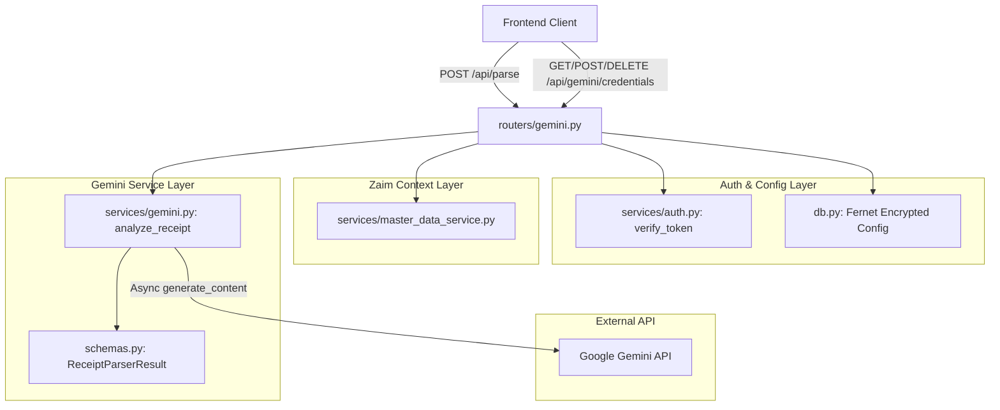
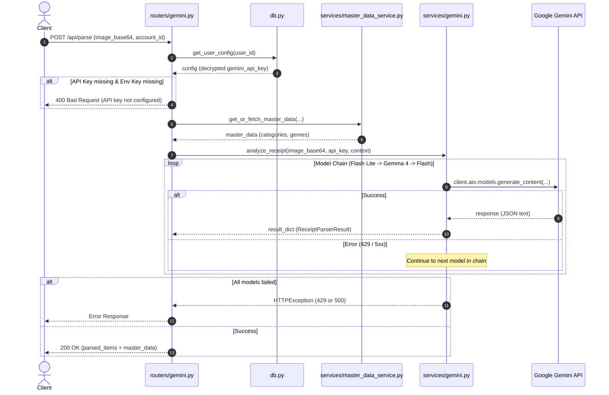

# Technical Design: gemini-api-backend

## Overview
本機能（`gemini-api-backend`）は、Zaim Lens においてレシート画像および購入履歴スクリーンショットを Google Gemini API を用いて自動解析し、品目・金額・日付・店舗名・ポイント利用額を抽出して Zaim のカテゴリおよびジャンルへ分類推論するバックエンド機能です。
ユーザー固有の Gemini API キーを暗号化して安全に保持するクレデンシャル管理、複数の Gemini / Gemma モデルによる自動フォールバック機構、および堅牢なエラーハンドリングを提供します。

### Goals
- ユーザーごとの Gemini API キーの安全な暗号化保存・取得（マスク表示）・削除の実現
- 画像データ（Base64）からの高精度なレシート明細抽出と Zaim マスタに基づくカテゴリ・ジャンル自動推論
- 複数モデル優先チェーン（`gemini-flash-lite-latest` → `gemma-4-26b-a4b-it` → `gemini-flash-latest`）による高可用性フォールバック
- レート制限（HTTP 429）や入力不備に対する明確なエラーハンドリング

### Non-Goals
- Zaim への支出データ本登録（`/api/register` は別仕様）
- フロントエンド UI / 画面コンポーネントの実装
- Zaim OAuth 認証フロー

---

## Boundary Commitments

### This Spec Owns
- Gemini API クレデンシャル管理エンドポイント（`/api/gemini/credentials`）
- レシート画像解析エンドポイント（`/api/parse`）
- Gemini API 呼び出し・プロンプト生成・構造化レスポンス（Structured Outputs）パーサー（`services/gemini.py`）
- ユーザー設定における API キーの暗号化（Fernet）および復号処理（`db.py`）
- Gemini 関連の Pydantic スキーマ定義（`schemas.py`）

### Out of Boundary
- Zaim への明細データ登録処理（`routers/zaim.py` の `/api/register`）
- Zaim マスタデータの取得・キャッシュ機構（`services/master_data_service.py`）
- Firebase 認証トークンの検証処理（`services/auth.py`）

### Allowed Dependencies
- `fastapi`, `pydantic` (Web API フレームワーク & スキーマ検証)
- `google-genai` (Google Gemini 公式 Python SDK)
- `cryptography.fernet` (API キー暗号化)
- `services.auth.verify_token` (ユーザー認証)
- `services.master_data_service.get_or_fetch_master_data` (マスタデータ参照)

### Revalidation Triggers
- Google GenAI SDK の API 破壊的変更（SDK バージョンアップ）
- Gemini モデルの廃止または新モデルの追加
- Zaim カテゴリ / ジャンルのマスタ構造の変更
- レシート出力 JSON スキーマ（`ReceiptParserResult`）のフィールド変更

---

## Architecture

### Architecture Pattern & Boundary Map
FastAPI による RESTful API レイヤー、GenAI SDK を内包したドメインサービスレイヤー、Fernet 暗号化を適用したデータアクセスレイヤーに明確に分離されたレイヤードアーキテクチャを採用しています。



### Technology Stack

| Layer | Choice / Version | Role in Feature | Notes |
|-------|------------------|-----------------|-------|
| Backend API | FastAPI | RESTful エンドポイント提供 | 非同期ルーティング |
| AI Integration | `google-genai` (v0.1+) | Gemini API との非同期通信・構造化出力 | `client.aio.models.generate_content` |
| Security / Cryptography | `cryptography` (Fernet) | API キーの対称暗号化保存 | `ENCRYPTION_KEY` による保護 |
| Data Validation | `pydantic` v2 | 入出力バリデーション & JSON Schema 定義 | Structured Outputs ガイド |
| Storage | JSON / File-based Storage | ユーザー設定の永続化 | `user_data/users_config.json` |

---

## File Structure Plan

### Directory Structure & Responsibilities
```
.
├── routers/
│   └── gemini.py         # [MODIFY/MAINTAIN] エンドポイントルーティングと入力検証
├── services/
│   └── gemini.py         # [MODIFY/MAINTAIN] GenAIクライアント呼び出し・モデルチェーン実行
├── schemas.py            # [MODIFY/MAINTAIN] Pydantic スキーマ定義
└── db.py                 # [MODIFY/MAINTAIN] ユーザー設定の暗号化保存・復号
```

### File Responsibilities Map
- `routers/gemini.py`: `/api/parse` および `/api/gemini/credentials` のルーティング、Zaimマスタコンテキスト生成、エラーハンドリング。
- `services/gemini.py`: Base64デコード、プロンプト構築、GenAI非同期クライアント初期化、モデルフォールバックループ、例外ハンドリング。
- `schemas.py`: `ReceiptItem`, `ReceiptParserResult`, `ParseRequest`, `GeminiCredentialsRequest` 等のデータ型定義。
- `db.py`: `get_user_config`, `save_user_config`, `encrypt_value`, `decrypt_value` による暗号化キー永続化。

---

## System Flows

### レシート画像解析フロー (Sequence Diagram)


---

## Requirements Traceability

| Requirement ID | Summary | Components | Interfaces / Endpoints | Notes |
|:---|:---|:---|:---|:---|
| **1.1** | APIキー暗号化保存 | `routers/gemini.py`, `db.py` | `POST /api/gemini/credentials` | Fernet 暗号化 |
| **1.2** | APIキー設定取得 (マスク表示) | `routers/gemini.py`, `db.py` | `GET /api/gemini/credentials` | `is_configured`, 末尾4桁 |
| **1.3** | APIキー削除 | `routers/gemini.py`, `db.py` | `DELETE /api/gemini/credentials` | 設定から除外して保存 |
| **1.4** | 環境変数共通キーフォールバック | `routers/gemini.py` | `/api/parse` | `GEMINI_API_KEY` 利用 |
| **2.1** | 明細・店舗・日付・ポイント抽出 | `services/gemini.py`, `schemas.py` | `analyze_receipt` | `ReceiptParserResult` |
| **2.2** | Zaimカテゴリ・ジャンル推論 | `routers/gemini.py`, `services/gemini.py` | `build_prompt_context` | プロンプト注入 |
| **2.3** | マスタデータレスポンス付与 | `routers/gemini.py` | `POST /api/parse` | `master_categories`, `master_genres` |
| **2.4** | Data URL / Base64 受理 | `services/gemini.py` | `analyze_receipt` | `split("base64,")[1]` |
| **3.1** | モデルチェーン優先試行 | `services/gemini.py` | `GEMINI_MODEL_CHAIN` | Flash Lite → Gemma 4 → Flash |
| **3.2** | エラー時の即座フォールバック | `services/gemini.py` | `analyze_receipt` | ループによる再試行 |
| **3.3** | 早期リターン | `services/gemini.py` | `analyze_receipt` | 初回成功で即時確定 |
| **4.1** | 不正 Base64 エラー (400) | `services/gemini.py` | `analyze_receipt` | `base64.b64decode` 例外捕捉 |
| **4.2** | APIキー未設定エラー (400) | `routers/gemini.py` | `POST /api/parse` | 400 HTTPException |
| **4.3** | Zaim未連携エラー (400) | `routers/gemini.py` | `POST /api/parse` | 400 HTTPException |
| **4.4** | レート制限 429 処理 | `services/gemini.py` | `analyze_receipt` | `errors.APIError` 429 捕捉 |
| **4.5** | 全体失敗 500 エラー | `services/gemini.py`, `routers/gemini.py` | `POST /api/parse` | 500 HTTPException |

---

## Components and Interfaces

### 1. API Routing Layer (`routers/gemini.py`)
- **Intent**: HTTP リクエストの受付、認証検証、Zaim マスタデータのコンテキスト構築、レスポンスの統合。
- **Requirements**: 1.1, 1.2, 1.3, 1.4, 2.2, 2.3, 4.2, 4.3, 4.5

#### API Contracts
| Method | Endpoint | Request Body | Response Body | Error Codes |
|---|---|---|---|---|
| `POST` | `/api/parse` | `ParseRequest` | `ReceiptParserResult` + マスタ | 400, 429, 500 |
| `GET` | `/api/gemini/credentials` | None | `{ "is_configured": bool, "api_key_last_4": str }` | 401, 500 |
| `POST` | `/api/gemini/credentials` | `GeminiCredentialsRequest` | `{ "status": "success", "message": str }` | 400, 401, 500 |
| `DELETE`| `/api/gemini/credentials` | None | `{ "status": "success", "message": str }` | 401, 500 |

### 2. Gemini Analysis Service (`services/gemini.py`)
- **Intent**: Google GenAI SDK を利用したレシート解析プロンプト実行とモデルフォールバック制御。
- **Requirements**: 2.1, 2.4, 3.1, 3.2, 3.3, 4.1, 4.4, 4.5

#### Service Interface
```python
async def analyze_receipt(
    image_base64: str,
    user_gemini_key: str,
    master_data_context: str
) -> Dict[str, Any]:
    """
    Base64画像データをデコードし、Geminiモデルチェーンを用いてレシート解析を実行する。
    
    Preconditions:
      - image_base64 は有効な画像データのBase64文字列（プレフィックス付き可）
      - user_gemini_key は有効なGemini APIキー
    Postconditions:
      - ReceiptParserResult の辞書表現を返却
    Raises:
      - HTTPException(400): Base64不正
      - HTTPException(429): 全モデルレート制限到達
      - HTTPException(500): 全モデル解析失敗
    """
```

---

## Data Models

```python
class ReceiptItem(BaseModel):
    name: str
    price: int
    category_id: int
    genre_id: int

class ReceiptParserResult(BaseModel):
    date: str              # YYYY-MM-DD
    store: str             # 店舗名
    items: List[ReceiptItem]
    point_usage: int       # ポイント利用額（利用なしは0）

class ParseRequest(BaseModel):
    image_base64: str
    account_id: Optional[str] = None

class GeminiCredentialsRequest(BaseModel):
    gemini_api_key: str
```

---

## Error Handling

| エラー種別 | HTTP Status | 発生条件 | ユーザー向けメッセージ / 振る舞い |
|:---|:---:|:---|:---|
| **Base64 デコードエラー** | `400` | 画像文字列のデコード失敗 | `"Invalid image base64 data"` |
| **API キー未設定** | `400` | ユーザーキーおよび環境変数キーが存在しない | `"Gemini API Key is not configured. 歯車アイコンからAPIキーを設定してください。"` |
| **Zaim 未連携** | `400` | ユーザーの Zaim アカウント設定が存在しない | `"Zaim連携が設定されていません。右上のアイコンからZaim連携を行ってください。"` |
| **レートリミット超過** | `429` | 全モデルで 429 制限に達した | `"Geminiの実行回数制限（レートリミット）に達しました。しばらく時間を置いてから再度お試しください。"` |
| **解析失敗 / サーバーエラー** | `500` | モデルチェーン全滅、API異常 | `"レシートの解析に失敗しました。Geminiからの応答が正しくないか、サーバーエラーが発生しました。詳細: ..."` |

---

## Testing Strategy

### 1. Unit Tests
- `test_credentials_encryption`: `db.py` による API キーの暗号化・復号のラウンドトリップ検証。
- `test_build_prompt_context`: カテゴリとジャンルリストから正しいプロンプト文字列が構築されるかの検証。
- `test_base64_sanitization`: Data URL プレフィックス付きおよびプレーンな Base64 のデコード処理検証。

### 2. Integration Tests (Mocked GenAI API)
- `test_analyze_receipt_success`: モックした Gemini API から正常な `ReceiptParserResult` JSON が返った際のパース検証。
- `test_analyze_receipt_fallback`: 最初のモデルが 429 または 500 を返した際に、第2のモデルへ自動フォールバックして成功することの検証。
- `test_analyze_receipt_all_fail_429`: 全モデルが 429 エラーとなった場合に HTTP 429 例外が発生することの検証。
- `test_api_parse_endpoint`: `/api/parse` エンドポイントにリクエストを送信し、マスタデータが付与されて 200 OK が返る統合検証。
