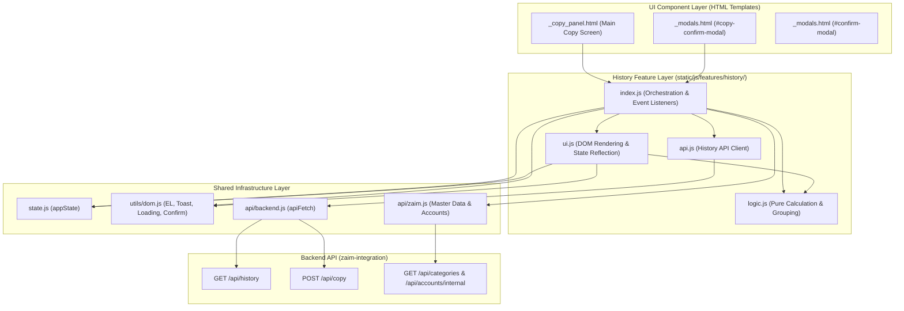
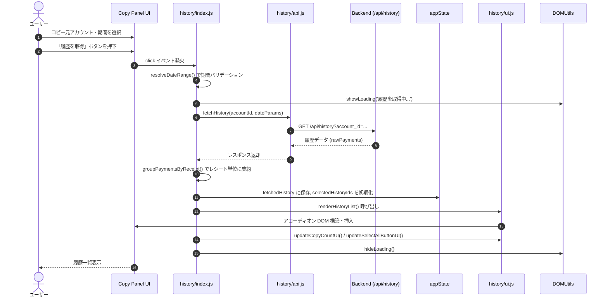
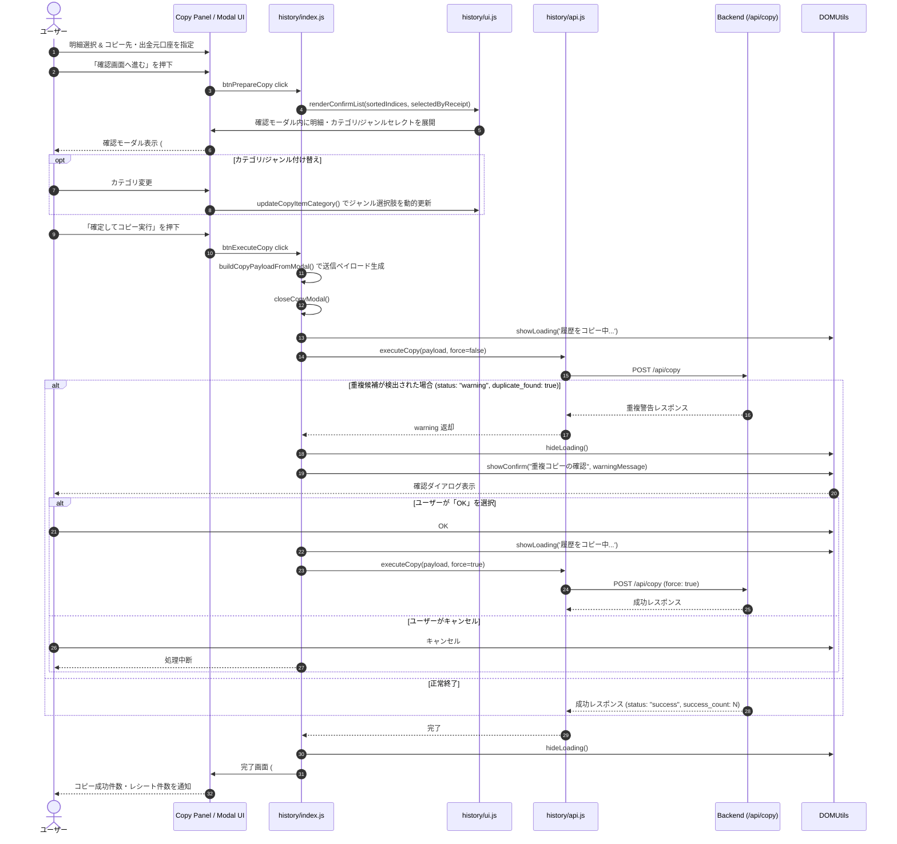

# Design Document: history-copy-ui

## Overview
本機能は、家計簿サービス「Zaim」の複数アカウント間において、支出履歴を取得・比較し、カテゴリやジャンル、出金元口座を柔軟に付け替えながら一括同期・コピーを行うフロントエンドユーザーインターフェース（アカウント間履歴コピー & 一括編集 UI）です。

個人用口座や共有用口座、家族間アカウントなど複数の家計簿を運用するユーザーが、手動での二重入力を行うことなく、直感的なアコーディオン一覧とプレビュー確認モーダルを通じて安全かつ効率的にデータを同期できる体験を提供します。

### Goals
- コピー元アカウントおよび柔軟な期間指定（今月/先月/過去1ヶ月/過去3ヶ月/月指定/カスタム範囲）による履歴データの取得
- レシート単位の自動グルーピングとアコーディオン展開・折りたたみによる明細確認
- 親子チェックボックス連動（不確定状態対応）および全選択/全解除による直感的な明細選択
- コピー確認モーダルにおける明細ごとのカテゴリ・ジャンル動的付替およびレシート単位の出金元口座指定
- 重複支出検知時の警告ダイアログと強制登録（force）再試行の安全なハンドリング

### Non-Goals
- バックエンド側の Zaim API 通信、OAuth 1.0a 認証処理、支出一括登録ロジックの実装（`zaim-integration` 仕様の所掌）
- レシート画像の OCR 解析および品目推論（`gemini-api-backend`, `receipt-workflow-ui` 仕様の所掌）

---

## Boundary Commitments

### This Spec Owns
- コピー元・コピー先アカウント選択および期間設定フォームの UI 制御
- 取得履歴のレシート単位グルーピング、アコーディオン描画、選択状態管理（`appState.selectedHistoryIds`）
- コピー確認モーダルの動的レンダリング、カテゴリ/ジャンル選択肢の連動更新
- コピー実行リクエストペイロードの構築、重複検知警告ダイアログの表示、完了画面への画面遷移およびリセット処理

### Out of Boundary
- Zaim API エンドポイント（OAuth 1.0a トークン交換、`/api/history`, `/api/copy` 等のバックエンド実装）
- Firestore へのアカウント認証情報・トークン・マスタデータの永続化
- レシート画像スキャン・OCR パイプライン

### Allowed Dependencies
- `zaim-integration` バックエンド API:
  - `GET /api/accounts`: アカウント一覧取得
  - `GET /api/categories?account_id={id}`: カテゴリ・ジャンルマスタ取得
  - `GET /api/accounts/internal?account_id={id}`: 有効出金元口座一覧取得
  - `GET /api/history`: 履歴明細取得
  - `POST /api/copy`: 履歴一括コピー実行
- 共通フロントエンドモジュール:
  - `static/js/state.js`: アプリケーション状態管理
  - `static/js/utils/dom.js`: DOM 参照、トースト、ローディング、共通ダイアログ
  - `static/js/api/backend.js`: 認証ヘッダー付与共通 fetch ラッパー

### Revalidation Triggers
- `/api/history` または `/api/copy` のリクエスト/レスポンススキーマ変更
- カテゴリ・ジャンルおよび口座マスタのデータ構造変更
- `appState` のグローバル状態管理インターフェース変更

---

## Architecture

### Architecture Pattern & Boundary Map
本機能は、Vanilla JS + ES Modules + Tailwind CSS によるステート駆動型のフロントエンドアーキテクチャを採用します。



### Technology Stack
| Layer | Choice / Version | Role in Feature | Notes |
|---|---|---|---|
| **Structure** | Jinja2 Template / HTML5 | パネルコンテナおよびモーダル構造の定義 | `_copy_panel.html`, `_modals.html` |
| **Styling** | Tailwind CSS / FontAwesome 6 | アコーディオン、バッジ、レスポンシブ配置 | ダークモード対応、Tailwind ユーティリティクラス |
| **Logic / Runtime** | Vanilla JavaScript (ES2022 Modules) | イベントハンドリング、純粋計算・グルーピング、DOM生成 | フレームワーク非依存 |
| **State** | In-Memory Object (`appState`) + localStorage | 履歴データ、選択アイテムSet、直近利用設定の保持 | ページリロード時のアカウント自動選択 |
| **API Client** | Native `fetch` + Firebase Auth JWT | バックエンド REST API との通信 | `apiFetch` 経由 |
| **Testing** | Node.js Test Runner (`node:test`) | 純粋計算・日付範囲・グルーピングの単体テスト | `tests/test_history_logic.js` |

---

## File Structure Plan

```text
zaim-lens/
├── templates/
│   └── components/
│       ├── _copy_panel.html        # コピー元/期間設定、履歴アコーディオン一覧、コピー先設定、完了画面
│       └── _modals.html            # コピー確認モーダル (#copy-confirm-modal), 重複確認 (#confirm-modal)
├── static/
│   └── js/
│       ├── features/
│       │   └── history/
│       │       ├── index.js        # イベント登録、コピー実行制御、リセット
│       │       ├── ui.js           # アコーディオン描画、確認モーダルリスト生成、カテゴリ連動、件数更新
│       │       ├── logic.js        # 純粋ロジック（日付計算、レシート集約、選択件数・マップ構築）
│       │       └── api.js          # /api/history および /api/copy の非同期呼び出し関数
│       ├── api/
│       │   ├── backend.js          # 共通 API クライアント (apiFetch)
│       │   └── zaim.js             # コピー先アカウント/出金元口座セレクトの連動更新
│       ├── utils/
│       │   └── dom.js              # DOM 要素参照 (EL)、トースト、確認ダイアログ
│       └── state.js                # アプリケーション共通状態定義
└── tests/
    └── test_history_logic.js       # history/logic.js の単体テストスイート (Node.js test runner)
```

---

## System Flows

### 1. 履歴取得 & アコーディオン表示フロー


### 2. コピー確認 & 一括実行フロー（重複ハンドリング含む）


---

## Requirements Traceability

| Requirement ID | 要件概要 | 設計要素（Components & Modules） | 主要インターフェース / 関数 |
| :--- | :--- | :--- | :--- |
| **1.1** | コピー元・期間指定と履歴取得 | `_copy_panel.html`, `index.js`, `api.js` | `resolveDateRange`, `fetchHistory`, `btnFetchHistory.addEventListener` |
| **1.2** | コピー元未選択時のバリデーション | `index.js`, `dom.js` | `showToast("コピー元アカウントを選択してください。", "warning")` |
| **1.3** | カスタム日付範囲の前後関係チェック | `index.js` | `resolveDateRange` 内の `startDate > endDate` チェック |
| **1.4** | コピー元変更時の初期化と選択肢除外 | `index.js`, `api/zaim.js` | `sourceAccountSelect.addEventListener('change')`, `updateDestAccountOptions` |
| **2.1** | レシート単位グルーピングとアコーディオン | `index.js`, `ui.js` | `groupPaymentsByReceipt`, `renderHistoryList` |
| **2.2** | アコーディオン展開/折りたたみ | `index.js`, `ui.js` | `window.toggleAccordion` |
| **2.3** | レシート単位親チェックボックス連動 | `index.js`, `ui.js` | `window.toggleHistorySelection`, `updateReceiptUIState` |
| **2.4** | 個別品目チェックボックスと不確定状態連動 | `index.js`, `ui.js` | `window.toggleItemSelection`, `updateReceiptUIState` (`indeterminate`) |
| **2.5** | 全選択/全解除ボタン連動 | `index.js`, `ui.js` | `btnSelectAll.addEventListener('click')`, `updateSelectAllButtonUI` |
| **3.1** | コピー先選択による口座・カテゴリマスタ連動 | `index.js`, `api/zaim.js` | `destAccountSelect.addEventListener('change')`, `loadDestInternalAccounts` |
| **3.2, 3.3** | 選択件数カウンターと確認ボタン活性制御 | `ui.js`, `index.js` | `getSelectedCounts`, `updateCopyCountUI` (`btnPrepareCopy.disabled`) |
| **4.1** | コピー内容確認モーダル表示 | `index.js`, `ui.js`, `_modals.html` | `buildSelectedByReceipt`, `renderConfirmList`, `btnPrepareCopy` |
| **4.2** | モーダル内カテゴリ/ジャンル動的付替 | `index.js`, `ui.js` | `window.updateCopyItemCategory`, `generateGenreOptions` |
| **4.3** | 出金元口座のデフォルト反映と個別指定 | `ui.js`, `index.js` | `renderConfirmList` 内の `group-account-select` |
| **5.1** | ペイロード構築とコピー実行要求 | `index.js`, `api.js` | `buildCopyPayloadFromModal`, `executeCopy`, `performCopy` |
| **5.2, 5.3** | 重複検知警告ダイアログと強制実行 | `index.js`, `dom.js` | `showConfirm`, `performCopy(force = true)` |
| **5.4** | コピー完了画面遷移と件数表示 | `index.js`, `_copy_panel.html` | `copyStepSuccess.classList.remove('hidden')`, `copy-success-message` |
| **5.5** | 状態リセットと初期画面復帰 | `index.js`, `ui.js` | `resetCopyApp`, `btnResetCopy.addEventListener` |

---

## Components and Interfaces

### Type Definitions (JSDoc / TypeScript Interface)

```typescript
/** 単一の履歴明細アイテム */
export interface RawHistoryItem {
  id: number;
  receipt_id?: number | null;
  date: string;              // YYYY-MM-DD
  amount: number;
  category_id: number;
  genre_id: number;
  category_name?: string;
  genre_name?: string;
  name?: string;
  place?: string;
  comment?: string;
  from_account_id?: number | null;
  mode: "payment" | "income" | "transfer";
}

/** レシート単位または単一支出でグルーピングされたデータ構造 */
export interface GroupedReceipt {
  isGroup: boolean;
  receipt_id?: number;
  id?: number;
  date: string;
  category_name?: string;
  place?: string;
  items: RawHistoryItem[];
  amount: number;
}

/** コピー実行APIへ送信する単一明細ペイロード */
export interface CopyItemPayload {
  category_id: number;
  genre_id: number;
  amount: number;
  date: string;
  name: string;
  place: string;
  comment: string;
  group_id: number;          // レシートグルーピング用識別インデックス
  from_account_id: number | null;
}

/** コピー実行APIリクエスト全体 */
export interface CopyRequestPayload {
  source_account_id: string;
  destination_account_id: string;
  from_account_id: number | null;
  items_to_copy: CopyItemPayload[];
  force: boolean;
}

/** コピー実行APIレスポンス */
export interface CopyResponse {
  status: "success" | "partial_success" | "warning" | "error";
  success_count?: number;
  registered_count?: number;
  duplicate_found?: boolean;
  message?: string;
}
```

---

## Error Handling

### 1. 入力バリデーションエラー (Client-Side)
- **コピー元未選択**: `showToast("コピー元アカウントを選択してください。", "warning")`
- **コピー先未選択**: `showToast("コピー先アカウントを選択してください。", "warning")`
- **月指定未入力**: `showToast("月を指定してください。", "warning")`
- **カスタム日付範囲の不正**: `showToast("開始日が終了日より後になっています。", "warning")`

### 2. 通信・サーバーエラー (5xx / Network Error)
- API 通信失敗時は `try...catch` で捕捉し、`hideLoading()` でスピナーを解除した上で `showToast("履歴の取得に失敗しました: " + err.message, "error")` を通知。

### 3. 重複データ警告ハンドリング (Business Warning)
- バックエンドが `duplicate_found: true` を返却した際、モーダルは閉じた状態を維持し、`showConfirm` ダイアログで「重複コピーの確認」メッセージを表示。
- ユーザーの「OK」承認によってのみ `force: true` で自動再実行。

---

## Testing Strategy

### 1. Static Analysis & Type Checking (必須静的検証)
- **コマンド**: `npx --package typescript tsc -p jsconfig.json --noEmit`
- **検証項目**:
  - ES Modules 間の import/export 契約および関数シグネチャ（引数型・個数・戻り値）の整合性
  - JSDoc 型アノテーションに基づく型安全性および未定義変数/プロパティ参照の排除
  - CI パイプライン（`Static Analysis` ワークフロー）との完全一致

### 2. Unit Tests (ロジック単体テスト)
- **コマンド**: `node --test tests/test_history_logic.js`
- **対象**: `static/js/features/history/logic.js`
- **検証項目**:
  - **日付範囲計算テスト (`calculateDateRange`)**: `this_month`, `last_month`, `month`, `custom`, 日数指定の算出精度および開始日>終了日のバリデーションエラー検知
  - **グルーピングテスト (`groupPaymentsByReceipt`)**: 同一 `receipt_id` を持つ複数明細の合約、合計金額の一致、単一明細の独立処理
  - **選択集計・データ構築テスト (`countSelectedItems`, `buildSelectedByReceipt`)**: 一意なレシート数・品目数の集計、モーダル用データ構造の正確性

### 3. UI / Integration Tests (結合・E2E検証)
- **アコーディオン操作**:
  - レシートヘッダークリックで明細リストの表示/非表示が切り替わること
  - 親チェックボックスのクリックで配下の子アイテム全選択/全解除が連動すること
  - 子チェックボックスの個別変更で親チェックボックスの `indeterminate` 状態が正しく反映されること
- **確認モーダル & カテゴリ連動**:
  - 「確認画面へ進む」押下で選択中明細のみがモーダルに一覧表示されること
  - カテゴリセレクトを変更した際に、該当品目のジャンルセレクトがコピー先マスタの対応ジャンル一覧で再生成されること
- **コピー実行 & 重複フロー**:
  - コピー実行時に正しい JSON ペイロードが送信されること
  - 重複警告時に確認ダイアログが表示され、OK 押下で `force: true` が付与されて再試行されること

### 4. Canonical Validation Commands (標準検証コマンドセット)
コミット前および機能完了時には、以下の全検証コマンドを実行してエラーがないことを確認する。
```bash
# 1. バックエンド単体・結合テスト
uv run pytest

# 2. フロントエンドロジック単体テスト
node --test tests/test_history_logic.js

# 3. フロントエンド静的型チェック
npx --package typescript tsc -p jsconfig.json --noEmit

# 4. スモーク起動テスト
uv run python -c "from main import app; from fastapi.testclient import TestClient; client = TestClient(app); res = client.get('/'); assert res.status_code == 200"
```
