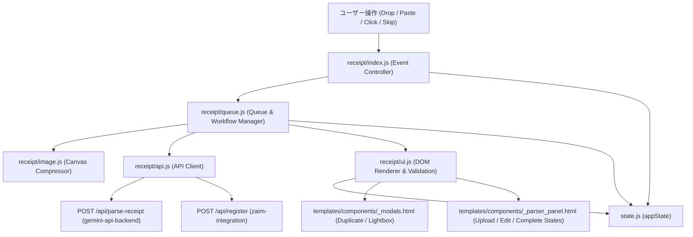
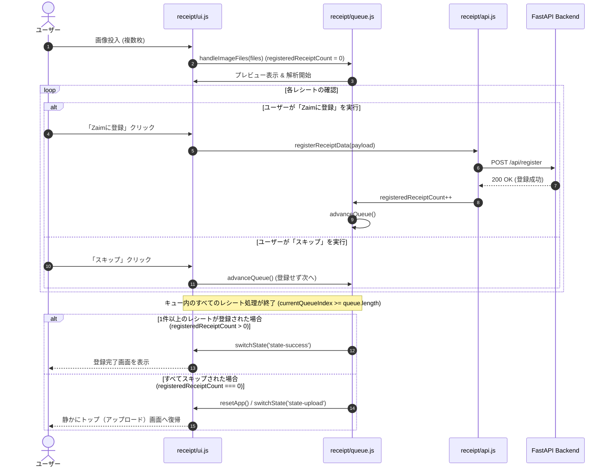

# Technical Design: receipt-workflow-ui

## Overview
本ドキュメントは、**Zaim Lens** における「レシート解析・編集・登録 UI ワークフロー (`receipt-workflow-ui`)」の技術設計書です。  
ユーザーが複数レシートの画像アップロード（ファイル選択・カメラ・ドラッグ＆ドロップ・クリップボード貼り付け）から、クライアント側画像圧縮、Gemini API による非同期構造化解析、インタラクティブな品目・カテゴリ編集、Zaim への支出一括登録および重複検知確認、そして全スキップ時の初期画面自動復帰までを、直感的かつストレスなく実行できるフロントエンドワークフローを規定します。

### Goals
- 複数レシート画像の入力・キューイング・最適化処理（Canvas 圧縮）の安定したクライアント処理の実現
- `gemini-api-backend`（`POST /api/parse-receipt`）との型安全な連携、進捗表示、およびエラー（APIキー未設定、レート制限等）時の誘導
- 店舗・日付・口座・各品目・カテゴリ/ジャンル連動・ポイント割引の快適なインライン編集とリアルタイム合計再計算
- `zaim-integration`（`POST /api/register`）との支出登録連携、重複候補検知時の確認モーダル表示、強制登録再送、およびキュー自動進行の実装
- キュー完了時のスマートな状態遷移（1件以上登録時は完了画面、全スキップなど登録0件時は初期アップロード画面へ静かに復帰）の実装
- Zaim アカウント切り替えに応じた口座一覧・マスタカテゴリの動的更新

### Non-Goals
- バックエンド側での Gemini OCR 解析処理・モデルフォールバック自体の実装（`gemini-api-backend` 仕様の所掌）
- バックエンド側での Zaim OAuth 認証処理・API トークン暗号化（`zaim-integration` 仕様の所掌）
- 支出履歴コピー専用パネル（`_copy_panel.html` / `features/history/`）の UI 制御

---

## Boundary Commitments

### This Spec Owns
- フロントエンドにおけるレシート処理ライフサイクル管理（Upload → Parsing → Editing → Duplicate Confirmation → Registering → Complete / Quiet Return）
- クライアント側での画像受付（File Input, Drag & Drop, Camera Capture, Clipboard Paste）および Canvas リサイズ・Base64 変換
- レシートキュー管理（順次バックグラウンド解析、アクティブ切り替え、スキップ、削除、登録成功件数の追跡と完了/復帰遷移）
- レシート解析結果の DOM レンダリング、インライン編集、カテゴリ・ジャンル連動セレクト、入力バリデーション
- 重複確認モーダル（`duplicate-modal`）の表示制御とユーザー選択（強制登録 / 中断）のハンドリング
- Zaim アカウント選択切り替えに伴う口座一覧・カテゴリ・ジャンルドロップダウンの更新

### Out of Boundary
- バックエンドの FastAPI ルーターおよび Service 層の実装（`routers/gemini.py`, `routers/zaim.py`, `services/*`）
- Firestore へのユーザー設定・認証情報の永続化（`db.py`）
- Google GenAI SDK や requests-oauthlib を利用した外部 API 通信

### Allowed Dependencies
- `gemini-api-backend` 仕様: `POST /api/parse-receipt` エンドポイントおよびレスポンススキーマ
- `zaim-integration` 仕様: `POST /api/register`, `GET /api/zaim/master`, `GET /api/zaim/accounts` エンドポイント
- Firebase Web SDK / `static/js/features/auth.js`: 認証トークン（JWT）取得
- 共有ユーティリティ: `static/js/utils/dom.js`, `static/js/utils/common.js`, `static/js/state.js`

### Revalidation Triggers
- `ParseReceiptResponse` または `RegisterReceiptRequest` の JSON スキーマ変更
- 重複検知時（HTTP 409 または重複警告オブジェクト）のレスポンス構造の変更
- Zaim マスタデータ（カテゴリ・ジャンル・口座）の取得 API 契約の変更

---

## Architecture

### Architecture Pattern & Boundary Map
本機能は、FastAPI + Jinja2 サーバーサイドレンダリング上に構築された Vanilla JS / ES Modules アーキテクチャに従います。  
`static/js/features/receipt/` ディレクトリ内に責務ごとに分割された 5 つのモジュールが、`state.js` を共有ステートとして協調動作します。



### Technology Stack
| レイヤ | 技術 / ライブラリ | 役割 | 備考 |
| :--- | :--- | :--- | :--- |
| **UI 構造** | Jinja2 HTML テンプレート | レシートアップロード/編集パネル、モーダルの構造定義 | `_parser_panel.html`, `_modals.html` |
| **スタイリング** | Tailwind CSS | レスポンシブレイアウト、状態に応じた表示切り替え、アニメーション | ダークモード対応 |
| **クライアントロジック** | JavaScript (ES Modules) | キュー管理、登録件数追跡、非同期 API 通信、DOM レンダリング、バリデーション | ビルド不要のネイティブ ES Modules |
| **画像処理** | HTML5 Canvas API | クライアント側での画像最大解像度制限・JPEG 圧縮・Base64 化 | サーバー転送量削減と高速化 |
| **状態管理** | `appState` (Vanilla JS Object) | キュー一覧、登録件数（`registeredReceiptCount`）、解析データ、アカウント | `state.js` にて集約管理 |

---

## File Structure Plan

```text
zaim-lens/
├── static/
│   └── js/
│       ├── features/
│       │   └── receipt/
│       │       ├── index.js      # [MODIFY] イベントリスナーの登録（スキップボタン含む）、Lightbox、一括カテゴリ適用
│       │       ├── queue.js      # [MODIFY] キュー追加、順次解析制御、登録件数カウンタ、advanceQueue（全スキップ分岐）
│       │       ├── ui.js         # [MODIFY] 明細描画、合計計算、カテゴリ/ジャンル連動、バリデーション、Undo、resetApp
│       │       ├── image.js      # [MODIFY] Canvas による画像リサイズ・品質圧縮・Base64 変換
│       │       └── api.js        # [MODIFY] /api/parse-receipt および /api/register の通信・エラー変換
│       └── state.js              # [MODIFY] registeredReceiptCount フィールド追加と初期構造定義
└── templates/
    └── components/
        ├── _parser_panel.html    # [MODIFY] アップロードエリア、キュー進捗、明細テーブル、ボタン群（スキップ/登録）
        └── _modals.html          # [MODIFY] 重複確認ダイアログ、画像拡大 Lightbox モーダル
```

---

## System Flows

### 1. レシート取り込み・解析・登録・終了のライフサイクルフロー


---

## Requirements Traceability

| Requirement ID | 要件サマリー | 担当コンポーネント | インターフェース / 契約 | システムフロー |
| :--- | :--- | :--- | :--- | :--- |
| **1.1** | 画像受付・キュー追加・プレビュー | `receipt/index.js`, `receipt/queue.js` | `handleImageFiles(files)` | ステップ 1–2 |
| **1.2** | クライアント側画像最適化（圧縮） | `receipt/image.js` | `compressImage(file)` | ステップ 2 |
| **1.3** | 複数キュー切り替え・ステータス表示 | `receipt/queue.js`, `receipt/ui.js` | `updateBatchProgressUI()` | ステップ 2, 7 |
| **1.4** | キューレシート削除・一覧更新 | `receipt/queue.js`, `receipt/ui.js` | `removeQueueItem(index)` | - |
| **1.5** | アクティブなレシートのスキップ操作 | `receipt/index.js`, `receipt/queue.js` | `advanceQueue()` | ステップ 8 |
| **2.1** | 解析中プログレス表示・二重送信防止 | `receipt/queue.js`, `receipt/ui.js` | `showLoading()`, `isParsing` | ステップ 2 |
| **2.2** | 解析結果の入力欄への自動反映 | `receipt/ui.js` | `setupEditState(parsedData)` | ステップ 2 |
| **2.3** | 未設定・未連携エラー時のモーダル誘導 | `receipt/queue.js`, `receipt/api.js` | `handleParseError(err)` | - |
| **2.4** | レート制限・解析失敗時の通知と再試行 | `receipt/queue.js`, `receipt/api.js` | `handleParseError(err)` | - |
| **3.1** | 店舗名・日付・口座の即時反映 | `receipt/ui.js` | `bindFormInputs()` | - |
| **3.2** | カテゴリ変更時のジャンル連動更新 | `receipt/ui.js` | `onCategoryChange(rowId, catId)` | - |
| **3.3** | 品目追加・削除・合計金額リアルタイム計算 | `receipt/ui.js` | `calcTotal()`, `renderItemsList()` | - |
| **3.4** | ポイント利用額の編集と実支払額反映 | `receipt/ui.js` | `calcTotal()` | - |
| **3.5** | 必須項目の入力バリデーション | `receipt/ui.js` | `validateReceiptForm()` | - |
| **4.1** | 編集済み明細の Zaim 登録要求 | `receipt/api.js`, `receipt/index.js` | `registerReceiptData(payload)` | ステップ 3–4 |
| **4.2** | 重複検知時の確認モーダル表示 | `receipt/ui.js`, `_modals.html` | `showDuplicateWarningModal()` | - |
| **4.3** | 強制登録（`force: true`）の再送 | `receipt/api.js` | `registerReceiptData(payload, true)` | - |
| **4.4** | 登録完了・キュー自動進行 | `receipt/queue.js`, `receipt/ui.js` | `advanceQueue()`, `showToast()` | ステップ 6–7 |
| **4.5** | 1件以上登録時の完了画面遷移 | `receipt/queue.js` | `advanceQueue()` -> `switchState('state-success')` | ステップ 9–10 |
| **4.6** | 全スキップ（0件登録）時の初期画面復帰 | `receipt/queue.js`, `receipt/ui.js` | `advanceQueue()` -> `resetApp()` | ステップ 11–12 |
| **5.1** | 未ログイン・未連携時のガイドバナー表示 | `receipt/ui.js`, `features/auth.js` | `updateAuthUIState()` | - |
| **5.2** | 複数アカウント選択とマスタデータ適用 | `receipt/ui.js`, `api/zaim.js` | `loadZaimAccounts(accountId)` | - |
| **5.3** | アカウント切り替え時の口座・カテゴリ更新 | `receipt/ui.js` | `onAccountSwitch(newAccountId)` | - |

---

## Components and Interfaces

### Detailed Component Specifications

#### 1. `state.js` & `receipt/queue.js` (Queue & Lifecycle Manager)
- **Intent**: レシート画像キューのライフサイクル（追加、圧縮、解析、次項目への進行、登録件数追跡、終了時分岐）を統括管理する。
- **Requirements**: 1.1, 1.3, 1.4, 1.5, 2.1, 2.3, 2.4, 4.4, 4.5, 4.6

##### JSDoc / TypeScript Interface Contracts
```typescript
interface AppState {
  queue: QueueItem[];
  currentQueueIndex: number;
  registeredReceiptCount: number; // 現在のキューセッションで正常にZaim登録されたレシート件数
  currentImageUri: string | null;
  isParsingLoopRunning: boolean;
  // ... その他の既存プロパティ
}

interface QueueManager {
  handleImageFiles(files: File[]): Promise<void>;
  startBackgroundParsing(): Promise<void>;
  advanceQueue(): Promise<void>;
  removeQueueItem(index: number): void;
  updateBatchProgressUI(): void;
}
```

- **Logic for `advanceQueue()`**:
  ```javascript
  export async function advanceQueue() {
      appState.currentQueueIndex++;

      if (appState.currentQueueIndex >= appState.queue.length) {
          const registeredCount = appState.registeredReceiptCount || 0;
          appState.currentQueueIndex = -1;
          appState.queue = [];
          appState.registeredReceiptCount = 0;
          parsePromises.clear();
          updateBatchProgressUI();
          hideLoading();

          if (registeredCount > 0) {
              switchState('state-success');
          } else {
              resetApp();
          }
          return;
      }
      // ... 次のレシートの表示・解析待機処理
  }
  ```

---

## Error Handling

### Error Strategy
- **400 Bad Request (APIキー未設定 / Zaim未連携)**:
  - 「設定を開く」ボタン付きダイアログ/トーストを表示。
- **409 Conflict (重複候補検知)**:
  - 既存支出情報をモーダルに提示し、「強制登録」または「キャンセル」をユーザーに選択させる。
- **429 Too Many Requests (レート制限)**:
  - 再試行ボタンを提供。
- **全スキップ / 0件登録**:
  - エラーではなく正常な中断フローとして扱い、不要なエラー表示や完了メッセージを出さず初期画面（`state-upload`）へ復帰。

---

## Testing Strategy

### 1. Unit Tests (クライアント側ロジック / ユーティリティ)
- `queue.js - advanceQueue()`:
  - `registeredReceiptCount > 0` の場合、最終的に `switchState('state-success')` が呼び出されること
  - `registeredReceiptCount === 0` の場合、`resetApp()` が呼び出され初期画面状態に戻ること
- `image.js`: 各種画像フォーマットの Canvas リサイズおよび Base64 圧縮処理の検証
- `ui.js - calcTotal()`: 複数品目の小計、ポイント割引、実支払合計金額の正確性の検証
- `ui.js - validateReceiptForm()`: 必須項目バリデーションの検証

### 2. Integration Tests (API 通信と UI 状態遷移)
- `parseReceiptImage` 呼び出しと解析成功時の `setupEditState` へのデータバインド
- `registerReceiptData` 成功時に `registeredReceiptCount` がインクリメントされることの検証

### 3. E2E / User Flow Tests
- **フロー 1 (複数枚投入 → 1件登録・1件スキップ → 完了画面)**:
  2枚のレシートのうち1枚を登録し、もう1枚をスキップした場合に「登録完了画面」が表示されること。
- **フロー 2 (複数枚投入 → すべてスキップ → トップ画面復帰)**:
  2枚のレシートを両方ともスキップした場合に「登録完了画面」が出ず、トップ画面（アップロード待機状態）へ静かに戻ること。
