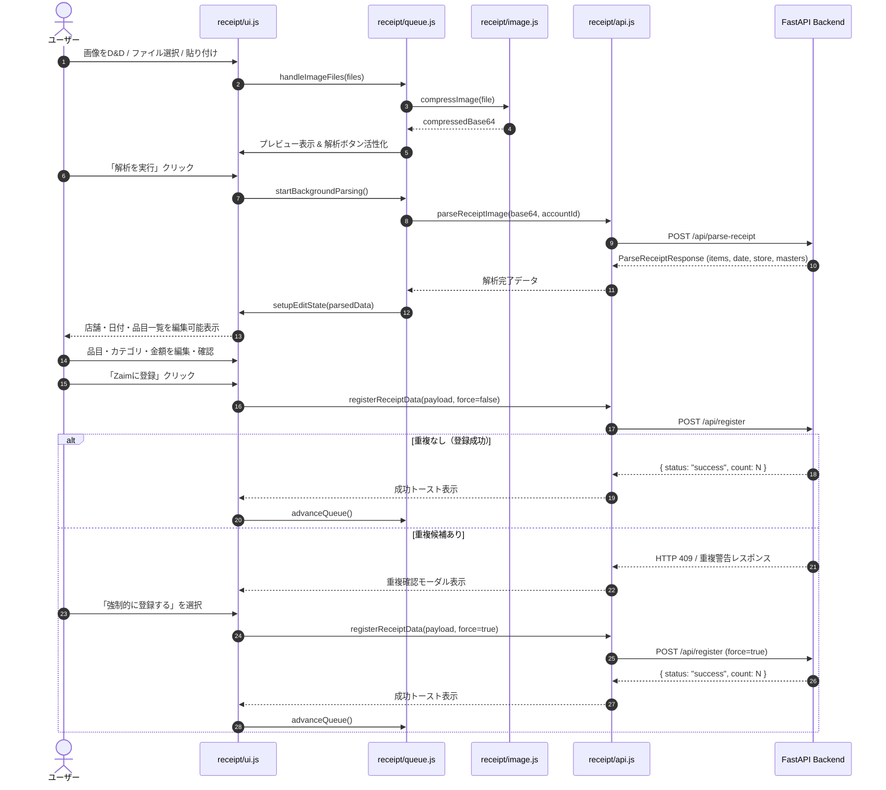

# Technical Design: receipt-workflow-ui

## Overview
本ドキュメントは、**Zaim Lens** における「レシート解析・編集・登録 UI ワークフロー (`receipt-workflow-ui`)」の技術設計書です。  
ユーザーが複数レシートの画像アップロード（ファイル選択・カメラ・ドラッグ＆ドロップ・クリップボード貼り付け）から、クライアント側画像圧縮、Gemini API による非同期構造化解析、インタラクティブな品目・カテゴリ編集、Zaim への支出一括登録および重複検知確認までを、直感的かつストレスなく実行できるフロントエンドワークフローを規定します。

### Goals
- 複数レシート画像の入力・キューイング・最適化処理（Canvas 圧縮）の安定したクライアント処理の実現
- `gemini-api-backend`（`POST /api/parse-receipt`）との型安全な連携、進捗表示、およびエラー（APIキー未設定、レート制限等）時の誘導
- 店舗・日付・口座・各品目・カテゴリ/ジャンル連動・ポイント割引の快適なインライン編集とリアルタイム合計再計算
- `zaim-integration`（`POST /api/register`）との支出登録連携、重複候補検知時の確認モーダル表示、強制登録再送、およびキュー自動進行の実装
- Zaim アカウント切り替えに応じた口座一覧・マスタカテゴリの動的更新

### Non-Goals
- バックエンド側での Gemini OCR 解析処理・モデルフォールバック自体の実装（`gemini-api-backend` 仕様の所掌）
- バックエンド側での Zaim OAuth 認証処理・API トークン暗号化（`zaim-integration` 仕様の所掌）
- 支出履歴コピー専用パネル（`_copy_panel.html` / `features/history/`）の UI 制御

---

## Boundary Commitments

### This Spec Owns
- フロントエンドにおけるレシート処理ライフサイクル管理（Upload → Parsing → Editing → Duplicate Confirmation → Registering → Complete）
- クライアント側での画像受付（File Input, Drag & Drop, Camera Capture, Clipboard Paste）および Canvas リサイズ・Base64 変換
- レシートキュー管理（順次バックグラウンド解析、アクティブ切り替え、削除、完了遷移）
- レシート解析結果の DOM レンダリング、インライン編集、カテゴリ・ジャンル連動セレクト、入力バリデーション
- 重複確認モーダル（`duplicate-modal`）の表示制御とユーザー選択（強制登録 / 中断）のハンドリング
- Zaim アカウント選択切り替えに伴う口座一覧・カテゴリ・ジャンルドロップダウンの更新

### Out of Boundary
- バックエンドの FastAPI ルーターおよび Service 層の実装（`routers/gemini.py`, `routers/zaim.py`, `services/*`）
- Firestore へのユーザー設定・認証情報の永続化（`db.py`）
- Google GenAI SDK や requests-oauthlib を利用した外部 API 通信

### Allowed Dependencies
- `gemini-api-backend` 仕様: `POST /api/parse-receipt` エンドポイントおよびレスポンススキーマ
- `zaim-integration` 仕様: `POST /api/register`, `GET /api/zaim/master`, `GET /api/zaim/accounts` エンドポイント
- Firebase Web SDK / `static/js/features/auth.js`: 認証トークン（JWT）取得
- 共有ユーティリティ: `static/js/utils/dom.js`, `static/js/utils/common.js`, `static/js/state.js`

### Revalidation Triggers
- `ParseReceiptResponse` または `RegisterReceiptRequest` の JSON スキーマ変更
- 重複検知時（HTTP 409 または重複警告オブジェクト）のレスポンス構造の変更
- Zaim マスタデータ（カテゴリ・ジャンル・口座）の取得 API 契約の変更

---

## Architecture

### Architecture Pattern & Boundary Map
本機能は、FastAPI + Jinja2 サーバーサイドレンダリング上に構築された Vanilla JS / ES Modules アーキテクチャに従います。  
`static/js/features/receipt/` ディレクトリ内に責務ごとに分割された 5 つのモジュールが、`state.js` を共有ステートとして協調動作します。


### Technology Stack
| レイヤ | 技術 / ライブラリ | 役割 | 備考 |
| :--- | :--- | :--- | :--- |
| **UI 構造** | Jinja2 HTML テンプレート | レシートアップロード/編集パネル、モーダルの構造定義 | `_parser_panel.html`, `_modals.html` |
| **スタイリング** | Tailwind CSS | レスポンシブレイアウト、状態に応じた表示切り替え、アニメーション | ダークモード対応 |
| **クライアントロジック** | JavaScript (ES Modules) | キュー管理、非同期 API 通信、DOM レンダリング、バリデーション | ビルド不要のネイティブ ES Modules |
| **画像処理** | HTML5 Canvas API | クライアント側での画像最大解像度制限・JPEG 圧縮・Base64 化 | サーバー転送量削減と高速化 |
| **状態管理** | `appState` (Vanilla JS Object) | キュー一覧、現在アクティブインデックス、解析データ、アカウント | `state.js` にて集約管理 |

---

## File Structure Plan

```text
zaim-lens/
├── static/
│   └── js/
│       ├── features/
│       │   └── receipt/
│       │       ├── index.js      # [MODIFY] イベントリスナーの登録、Lightbox、一括カテゴリ適用
│       │       ├── queue.js      # [MODIFY] キュー追加、順次解析制御、進捗UI更新、advanceQueue
│       │       ├── ui.js         # [MODIFY] 明細描画、合計計算、カテゴリ/ジャンル連動、バリデーション、Undo
│       │       ├── image.js      # [MODIFY] Canvas による画像リサイズ・品質圧縮・Base64 変換
│       │       └── api.js        # [MODIFY] /api/parse-receipt および /api/register の通信・エラー変換
│       └── state.js              # [MODIFY] レシートキューおよび解析ステートの型・初期構造定義
└── templates/
    └── components/
        ├── _parser_panel.html    # [MODIFY] アップロードエリア、キュー進捗、明細テーブル、ボタン群
        └── _modals.html          # [MODIFY] 重複確認ダイアログ、画像拡大 Lightbox モーダル
```

---

## System Flows

### 1. レシート取り込み・解析・登録の標準ワークフロー


---

## Requirements Traceability

| Requirement ID | 要件サマリー | 担当コンポーネント | インターフェース / 契約 | システムフロー |
| :--- | :--- | :--- | :--- | :--- |
| **1.1** | 画像受付・キュー追加・プレビュー | `receipt/index.js`, `receipt/queue.js` | `handleImageFiles(files)` | ステップ 1–4 |
| **1.2** | クライアント側画像最適化（圧縮） | `receipt/image.js` | `compressImage(file)` | ステップ 2–3 |
| **1.3** | 複数キュー切り替え・ステータス表示 | `receipt/queue.js`, `receipt/ui.js` | `updateBatchProgressUI()` | ステップ 4, 18 |
| **1.4** | キューレシート削除・一覧更新 | `receipt/queue.js`, `receipt/ui.js` | `removeQueueItem(index)` | - |
| **2.1** | 解析中プログレス表示・二重送信防止 | `receipt/queue.js`, `receipt/ui.js` | `showLoading()`, `isParsing` | ステップ 5–7 |
| **2.2** | 解析結果の入力欄への自動反映 | `receipt/ui.js` | `setupEditState(parsedData)` | ステップ 8–10 |
| **2.3** | 未設定・未連携エラー時のモーダル誘導 | `receipt/queue.js`, `receipt/api.js` | `handleParseError(err)` | - |
| **2.4** | レート制限・解析失敗時の通知と再試行 | `receipt/queue.js`, `receipt/api.js` | `handleParseError(err)` | - |
| **3.1** | 店舗名・日付・口座の即時反映 | `receipt/ui.js` | `bindFormInputs()` | ステップ 11 |
| **3.2** | カテゴリ変更時のジャンル連動更新 | `receipt/ui.js` | `onCategoryChange(rowId, catId)` | ステップ 11 |
| **3.3** | 品目追加・削除・合計金額リアルタイム計算 | `receipt/ui.js` | `calcTotal()`, `renderItemsList()` | ステップ 11 |
| **3.4** | ポイント利用額の編集と実支払額反映 | `receipt/ui.js` | `calcTotal()` | ステップ 11 |
| **3.5** | 必須項目の入力バリデーション | `receipt/ui.js` | `validateReceiptForm()` | ステップ 12 |
| **4.1** | 編集済み明細の Zaim 登録要求 | `receipt/api.js`, `receipt/index.js` | `registerReceiptData(payload)` | ステップ 12–14 |
| **4.2** | 重複検知時の確認モーダル表示 | `receipt/ui.js`, `_modals.html` | `showDuplicateWarningModal()` | ステップ 15–16 |
| **4.3** | 強制登録（`force: true`）の再送 | `receipt/api.js` | `registerReceiptData(payload, true)` | ステップ 17 |
| **4.4** | 登録完了・キュー自動進行 | `receipt/queue.js`, `receipt/ui.js` | `advanceQueue()`, `showToast()` | ステップ 18 |
| **5.1** | 未ログイン・未連携時のガイドバナー表示 | `receipt/ui.js`, `features/auth.js` | `updateAuthUIState()` | - |
| **5.2** | 複数アカウント選択とマスタデータ適用 | `receipt/ui.js`, `api/zaim.js` | `loadZaimAccounts(accountId)` | - |
| **5.3** | アカウント切り替え時の口座・カテゴリ更新 | `receipt/ui.js` | `onAccountSwitch(newAccountId)` | - |

---

## Components and Interfaces

### Component Summary
| コンポーネント | 種別 | 責務 | カバーする要件 | 主な依存関係 |
| :--- | :--- | :--- | :--- | :--- |
| `receipt/index.js` | Controller | イベントリスナー初期化、Lightbox、一括カテゴリ適用 | 1.1, 4.1 | `queue.js`, `ui.js`, `dom.js` |
| `receipt/queue.js` | Service / State | 複数画像キューの順次管理、バックグラウンド解析、進捗表示 | 1.1, 1.3, 1.4, 2.1, 2.3, 2.4, 4.4 | `api.js`, `image.js`, `ui.js`, `state.js` |
| `receipt/image.js` | Utility | Canvas によるクライアント側画像圧縮・リサイズ | 1.2 | HTML5 Canvas |
| `receipt/ui.js` | View / Presenter | 明細テーブル描画、合計金額計算、カテゴリ連動、バリデーション、モーダル制御 | 1.3, 2.2, 3.1–3.5, 4.2, 5.1–5.3 | `state.js`, `dom.js`, `api/zaim.js` |
| `receipt/api.js` | API Client | `/api/parse-receipt` および `/api/register` の通信とエラー正規化 | 2.1, 2.3, 2.4, 4.1, 4.3 | `auth.js`, `common.js` |

---

### Detailed Component Specifications

#### 1. `receipt/queue.js` (Queue Manager)
- **Intent**: レシート画像キューのライフサイクル（追加、圧縮、解析、次項目への進行）を統括管理する。
- **Requirements**: 1.1, 1.3, 1.4, 2.1, 2.3, 2.4, 4.4

##### JSDoc / TypeScript Interface Contracts
```typescript
interface QueueItem {
  file: File | null;
  status: 'idle' | 'compressing' | 'parsing' | 'complete' | 'error';
  result: ParseReceiptResponse | null;
  compressedBase64: string | null;
  errorMessage?: string;
}

interface QueueManager {
  handleImageFiles(files: File[]): Promise<void>;
  startBackgroundParsing(): Promise<void>;
  advanceQueue(): Promise<void>;
  removeQueueItem(index: number): void;
  updateBatchProgressUI(): void;
}
```

- **Preconditions**: 画像ファイル（JPEG/PNG/WEBP）が入力されること。
- **Postconditions**: キュー内の各アイテムが順次圧縮・解析され、`appState.queue` に格納される。
- **Invariants**: `currentQueueIndex` は常に `-1` 以上 `queue.length` 未満である。

---

#### 2. `receipt/ui.js` (DOM Renderer & Validation)
- **Intent**: レシート明細テーブルの動的レンダリング、合計金額の再計算、カテゴリ/ジャンル選択肢の連動更新、バリデーションおよびモーダル表示を行う。
- **Requirements**: 1.3, 2.2, 3.1, 3.2, 3.3, 3.4, 3.5, 4.2, 5.1, 5.2, 5.3

##### JSDoc / TypeScript Interface Contracts
```typescript
interface ReceiptUI {
  setupEditState(parsedData: ParseReceiptResponse): void;
  renderItemsList(): void;
  calcTotal(): { subtotal: number; pointDiscount: number; total: number };
  validateReceiptForm(): boolean;
  onCategoryChange(itemIndex: number, categoryId: number): void;
  showDuplicateWarningModal(existingItems: DuplicateItemSummary[], onConfirm: () => void): void;
  loadZaimAccounts(targetAccountId?: string | number): Promise<void>;
  resetApp(): void;
}
```

- **Validation Rules**:
  - `date`: YYYY-MM-DD 形式、空欄不可
  - `items`: 削除フラグ（`deleted: true`）以外の有効な明細が 1 件以上存在すること
  - `item.name`: 空白文字のみは不可
  - `item.amount`: 1 円以上の整数（非負）
  - `point_usage`: 0 以上の整数

---

#### 3. `receipt/api.js` (API Client)
- **Intent**: バックエンド API との HTTP 通信を行い、認証ヘッダーの付与、エラーレスポンスの正規化を行う。
- **Requirements**: 2.1, 2.3, 2.4, 4.1, 4.3

##### API Contracts
| メソッド | エンドポイント | リクエスト型 | レスポンス型 | 想定エラーコード |
| :--- | :--- | :--- | :--- | :--- |
| `POST` | `/api/parse-receipt` | `ParseReceiptRequest` | `ParseReceiptResponse` | `400` (未連携/キー未設定/画像無効), `429` (RateLimit), `500` |
| `POST` | `/api/register` | `RegisterReceiptRequest` | `RegisterReceiptResponse` | `400` (不正データ), `409` (重複候補あり), `500` |

```typescript
interface ParseReceiptRequest {
  image_data: string; // Base64 (data:image/...;base64,... または純粋Base64)
  account_id?: string | number;
}

interface ParseReceiptResponse {
  date: string;
  store: string;
  point_usage: number;
  items: Array<{
    name: string;
    amount: number;
    category_id: number;
    genre_id: number;
  }>;
  master_categories: Array<{ id: number; name: string }>;
  master_genres: Array<{ id: number; category_id: number; name: string }>;
}

interface RegisterReceiptRequest {
  date: string;
  store: string;
  from_account_id?: number | null;
  receipt_group_id?: string;
  force?: boolean;
  account_id?: string | number;
  items: Array<{
    name: string;
    amount: number;
    category_id: number;
    genre_id: number;
  }>;
  point_usage?: number;
}
```

---

## Error Handling

### Error Strategy
- **400 Bad Request (APIキー未設定 / Zaim未連携)**:
  - 単なるエラー表示で終わらせず、ユーザーが直ちに設定画面へ遷移できるよう「設定を開く」ボタン付きダイアログ/トーストを表示。
- **409 Conflict (重複候補検知)**:
  - 処理を中断し、既存の支出情報（日付・金額・店舗名）をモーダルに提示した上で、「強制登録」または「キャンセル」をユーザーに明示的に選択させる。
- **429 Too Many Requests (レート制限)**:
  - 「Gemini API の利用上限に達しました。しばらく時間をおいて再試行してください」と通知し、再試行ボタンを提供。
- **クライアント側入力エラー (Validation Failure)**:
  - 該当フィールドを赤枠ハイライトし、登録ボタンを無効化（Disabled）して不正リクエストの送信を防止。

---

## Testing Strategy

### 1. Unit Tests (クライアント側ロジック / ユーティリティ)
- `image.js`: 各種画像フォーマット（JPEG/PNG/WEBP）の Canvas リサイズおよび Base64 圧縮処理の検証
- `ui.js - calcTotal()`: 複数品目の小計、ポイント割引（マイナス計算）、実支払合計金額の正確性の検証
- `ui.js - validateReceiptForm()`: 日付未指定、品名空欄、0円以下金額におけるバリデーション判定の検証
- `queue.js`: キュー追加、順次ステータス更新、`advanceQueue` によるキュー消化ロジックの検証

### 2. Integration Tests (API 通信と UI 状態遷移)
- `parseReceiptImage` 呼び出しと解析成功時の `setupEditState` へのデータバインド
- 400 エラー（APIキー未設定・Zaim未連携）受信時の設定モーダル起動ハンドリング
- `registerReceiptData` での 409 重複レスポンス受信時における `showDuplicateWarningModal` 表示と `force: true` による再送フローの検証

### 3. E2E / User Flow Tests
- **フロー 1 (画像アップロード → 解析 → 編集 → 正常登録)**:
  画像選択から Gemini 解析結果の展開、品目追加・金額修正、Zaim への一括登録成功までの一連のフロー
- **フロー 2 (複数レシートのバッチキュー処理)**:
  3枚のレシート画像を一括投入し、順次解析・確認・登録を経てキューが全件完了するフロー
- **フロー 3 (重複警告ハンドリングフロー)**:
  登録時に既存支出との重複が検知された際に、モーダルで詳細を確認し、強制登録を実行して正常完了するフロー
