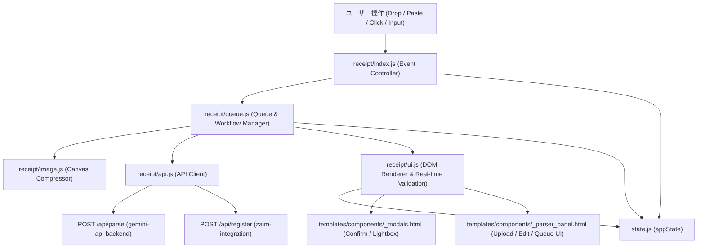
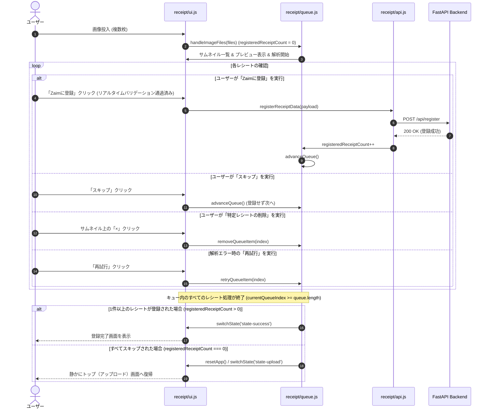
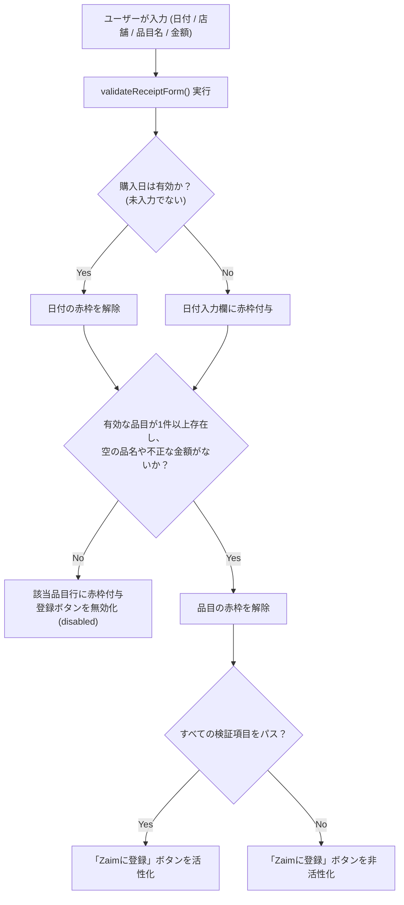

# Technical Design: receipt-workflow-ui

## Overview
本ドキュメントは、**Zaim Lens** における「レシート解析・編集・登録 UI ワークフロー (`receipt-workflow-ui`)」の技術設計書です。  
ユーザーが複数レシートの画像アップロード（ファイル選択・カメラ・ドラッグ＆ドロップ・クリップボード貼り付け）から、クライアント側画像圧縮、Gemini API による非同期構造化解析、インタラクティブな品目・カテゴリ編集、リアルタイム入力バリデーション、Zaim への支出一括登録および重複検知確認、そして全スキップ時の初期画面自動復帰までを、直感的かつストレスなく実行できるフロントエンドワークフローを規定します。

### Goals
- 複数レシート画像の入力・キューイング・最適化処理（Canvas 圧縮）の安定したクライアント処理の実現
- キュー内サムネイル一覧表示、アクティブ切り替え、個別削除（`removeQueueItem`）およびエラー時のインライン再試行機能の提供
- `gemini-api-backend`（`POST /api/parse`）との型安全な連携、進捗表示、およびエラー（APIキー未設定、レート制限等）時の誘導
- 店舗・日付・口座・各品目・カテゴリ/ジャンル連動・ポイント割引の快適なインライン編集とリアルタイム合計再計算
- 日付・品目名・金額のリアルタイム入力バリデーション（赤枠ハイライトおよび登録ボタンの即時制御）
- `zaim-integration`（`POST /api/register`）との支出登録連携、重複候補検知時の確認モーダル表示、強制登録再送、およびキュー自動進行の実装
- キュー完了時のスマートな状態遷移（1件以上登録時は完了画面、全スキップなど登録0件時は初期アップロード画面へ静かに復帰）の実装
- 未ログインまたは Zaim 未連携時のガイドバナー表示、および Zaim アカウント切り替えに応じた口座一覧・マスタカテゴリの動的更新

### Non-Goals
- バックエンド側での Gemini OCR 解析処理・モデルフォールバック自体の実装（`gemini-api-backend` 仕様の所掌）
- バックエンド側での Zaim OAuth 認証処理・API トークン暗号化（`zaim-integration` 仕様の所掌）
- 支出履歴コピー専用パネル（`_copy_panel.html` / `features/history/`）の UI 制御

---

## Boundary Commitments

### This Spec Owns
- フロントエンドにおけるレシート処理ライフサイクル管理（Upload → Parsing → Editing → Duplicate Confirmation → Registering → Complete / Quiet Return）
- クライアント側での画像受付（File Input, Drag & Drop, Camera Capture, Clipboard Paste）および Canvas リサイズ・Base64 変換
- レシートキュー管理（順次バックグラウンド解析、アクティブ切り替え、サムネイル一覧UI、個別削除、再試行、スキップ、登録成功件数の追跡と完了/復帰遷移）
- レシート解析結果の DOM レンダリング、インライン編集、カテゴリ・ジャンル連動セレクト、リアルタイム入力バリデーション
- 重複確認ダイアログ（`showConfirm` / `confirm-modal`）の表示制御とユーザー選択（強制登録 / 中断）のハンドリング
- 未連携時ガイドバナーの表示制御、および Zaim アカウント選択切り替えに伴う口座一覧・カテゴリ・ジャンルドロップダウンの動的更新

### Out of Boundary
- バックエンドの FastAPI ルーターおよび Service 層の実装（`routers/gemini.py`, `routers/zaim.py`, `services/*`）
- Firestore へのユーザー設定・認証情報の永続化（`db.py`）
- Google GenAI SDK や requests-oauthlib を利用した外部 API 通信処理

### Allowed Dependencies
- `gemini-api-backend` 仕様: `POST /api/parse` エンドポイントおよびレスポンススキーマ
- `zaim-integration` 仕様: `POST /api/register`, `GET /api/zaim/master`, `GET /api/zaim/accounts` エンドポイント
- Firebase Web SDK / `static/js/features/auth.js`: 認証トークン（JWT）取得
- 共有ユーティリティ: `static/js/utils/dom.js`, `static/js/utils/common.js`, `static/js/state.js`

### Revalidation Triggers
- `POST /api/parse` または `POST /api/register` の JSON スキーマ変更
- 重複検知時（HTTP 409 または重複警告オブジェクト）のレスポンス構造の変更
- Zaim マスタデータ（カテゴリ・ジャンル・口座）の取得 API 契約の変更

---

## Architecture

### Existing Architecture Analysis
- **現状の構成**: FastAPI + Jinja2 によるサーバーサイドHTML配信と、Vanilla JS (ES Modules) によるクライアントサイドアクション。
- **データフロー**: `static/js/features/receipt/` の各モジュールが `state.js`（`appState`）を介して状態を共有。
- **拡張方針**: 既存の責務分離（`queue.js` = キュー進行, `ui.js` = DOMレンダリング/バリデーション, `api.js` = 通信, `image.js` = Canvas圧縮, `index.js` = イベント統括）を厳格に維持し、残存ギャップ（サムネイル操作、リアルタイムバリデーション、再試行ボタン、ガイドバナー）を自然に統合する。

### Architecture Pattern & Boundary Map



### Technology Stack

| レイヤ | 技術 / ライブラリ | 役割 | 備考 |
| :--- | :--- | :--- | :--- |
| **UI 構造** | Jinja2 HTML テンプレート | レシートアップロード/編集パネル、キューサムネイルバー、バナー | `_parser_panel.html`, `_modals.html` |
| **スタイリング** | Tailwind CSS | レスポンシブレイアウト、状態に応じた表示切り替え、赤枠バリデーション | ダークモード対応 |
| **クライアントロジック** | JavaScript (ES Modules) | キュー管理、登録件数追跡、非同期 API 通信、DOM レンダリング、バリデーション | ネイティブ ES Modules |
| **画像処理** | HTML5 Canvas API | クライアント側での画像最大解像度制限・JPEG 圧縮・Base64 化 | 1600px / 品質 0.85 |
| **状態管理** | `appState` (Vanilla JS Object) | キュー一覧、登録件数（`registeredReceiptCount`）、解析データ、アカウント | `state.js` 集約管理 |

---

## File Structure Plan

```text
zaim-lens/
├── static/
│   └── js/
│       ├── features/
│       │   └── receipt/
│       │       ├── index.js      # [MODIFY] イベント登録、入力監視（バリデーション発火）、再試行イベント
│       │       ├── queue.js      # [MODIFY] キュー追加、順次解析、個別アイテム再試行、選択切り替え、削除、終了分岐
│       │       ├── ui.js         # [MODIFY] キューサムネイル一覧描画、リアルタイムバリデーション（赤枠/ボタン制御）、明細描画
│       │       ├── image.js      # [UNCHANGED] Canvas リサイズ・品質圧縮・Base64 変換
│       │       └── api.js        # [UNCHANGED] /api/parse および /api/register の通信・エラー変換
│       └── state.js              # [MODIFY] キューアイテムの retry カウントやステータス型の明確化
├── templates/
│   └── components/
│       ├── _parser_panel.html    # [MODIFY] キューサムネイル一覧バー、再試行ボタン、未連携ガイドバナーの追加
│       └── _modals.html          # [UNCHANGED] 重複確認ダイアログ（confirm-modal）、Lightbox モーダル
└── tests/
    ├── test_receipt_queue_logic.js # [MODIFY] キュー選択切り替え、削除、全スキップ復帰のテスト拡充
    └── test_receipt_validation.js  # [NEW] 必須項目・金額・日付のバリデーション純粋関数の単体テスト
```

---

## System Flows

### 1. レシート取り込み・解析・登録・終了のライフサイクルフロー


### 2. リアルタイム入力バリデーションフロー


---

## Requirements Traceability

| Requirement ID | 要件サマリー | 担当コンポーネント | インターフェース / 契約 |
| :--- | :--- | :--- | :--- |
| **1.1** | 画像受付・キュー追加・プレビュー | `receipt/index.js`, `receipt/queue.js` | `handleImageFiles(files: File[])` |
| **1.2** | クライアント側画像最適化（圧縮） | `receipt/image.js` | `compressImage(file: File): Promise<string>` |
| **1.3** | 複数キュー切り替え・ステータス表示 | `receipt/queue.js`, `receipt/ui.js` | `renderQueueThumbnails()`, `selectQueueItem(index)` |
| **1.4** | キューレシート削除・一覧更新 | `receipt/queue.js`, `receipt/ui.js` | `removeQueueItem(index: number)` |
| **1.5** | アクティブなレシートのスキップ操作 | `receipt/index.js`, `receipt/queue.js` | `advanceQueue()` |
| **2.1** | 解析中プログレス表示・二重送信防止 | `receipt/queue.js`, `receipt/ui.js` | `showLoading()`, `appState.isParsingLoopRunning` |
| **2.2** | 解析結果の入力欄への自動反映 | `receipt/ui.js` | `setupEditState(parsedData)` |
| **2.3** | 未設定・未連携エラー時のモーダル誘導 | `receipt/queue.js`, `features/settings.js` | `openGeminiSettings()`, `openZaimSettings()` |
| **2.4** | レート制限・失敗時の通知と再試行ボタン | `receipt/queue.js`, `receipt/ui.js` | `retryQueueItem(index)`, `#btn-parse-retry` |
| **3.1** | 店舗名・日付・口座の即時反映 | `receipt/ui.js`, `receipt/index.js` | `appState.parsedData` へのイベントバインド |
| **3.2** | カテゴリ変更時のジャンル連動更新 | `receipt/ui.js` | `generateCategoryOptions()`, `generateGenreOptions()` |
| **3.3** | 品目追加・削除・合計金額リアルタイム計算 | `receipt/ui.js` | `calcTotal()`, `renderItemsList()`, `undoDeletion()` |
| **3.4** | ポイント利用額の反映と実支払額計算 | `receipt/queue.js`, `receipt/ui.js` | 負額品目「ポイント利用」の挿入と合計控除 |
| **3.5** | 必須項目のリアルタイム検証とボタン制御 | `receipt/ui.js` | `validateReceiptForm(): boolean` |
| **4.1** | 編集済み明細の Zaim 登録要求 | `receipt/api.js`, `receipt/index.js` | `registerReceiptData(payload)` |
| **4.2** | 重複検知時の確認モーダル表示 | `receipt/index.js`, `utils/dom.js` | `showConfirm("二重登録の確認", msg)` |
| **4.3** | 強制登録（`force: true`）の再送 | `receipt/index.js`, `receipt/api.js` | `registerReceiptData(payload, true)` |
| **4.4** | 登録完了・キュー自動進行 | `receipt/queue.js`, `receipt/ui.js` | `advanceQueue()`, `showToast("success")` |
| **4.5** | 1件以上登録時の完了画面遷移 | `receipt/queue.js` | `advanceQueue()` -> `switchState('state-success')` |
| **4.6** | 全スキップ（0件登録）時の初期画面復帰 | `receipt/queue.js`, `receipt/ui.js` | `advanceQueue()` -> `resetApp()` |
| **5.1** | 未ログイン・未連携時のガイドバナー表示 | `receipt/ui.js`, `templates/_parser_panel.html` | `#unlinked-guide-banner`, `btnParse.disabled = true` |
| **5.2** | 複数アカウント選択とマスタデータ適用 | `receipt/ui.js`, `api/zaim.js` | `loadZaimAccounts(targetData)` |
| **5.3** | アカウント切り替え時の口座・カテゴリ更新 | `receipt/index.js`, `receipt/ui.js` | `EL.editTargetAccount` change リスナー連動 |

---

## Components and Interfaces

### Component Summary Table

| Component | Layer | Intent | Req Coverage | Key Dependencies | Contracts |
| :--- | :--- | :--- | :--- | :--- | :--- |
| `receipt/queue.js` | Logic | キュー進行、解析ループ、終了分岐、アイテム再試行・削除 | 1.1, 1.3, 1.4, 1.5, 2.1, 2.3, 2.4, 4.4, 4.5, 4.6 | `state.js`, `api.js`, `image.js`, `ui.js` | State, Service |
| `receipt/ui.js` | Presentation | DOMレンダリング、サムネイル一覧、リアルタイムバリデーション、合計計算 | 1.3, 1.4, 2.2, 3.1, 3.2, 3.3, 3.4, 3.5, 5.1, 5.2, 5.3 | `state.js`, `dom.js`, `zaim.js` | State, Service |
| `receipt/index.js` | Controller | DOMイベント登録、登録/スキップ/再試行の発火、重複確認 | 1.1, 1.5, 3.1, 4.1, 4.2, 4.3, 5.3 | `queue.js`, `ui.js`, `api.js` | Event |
| `receipt/image.js` | Utility | HTML5 Canvas による画像リサイズ・Base64圧縮 | 1.2 | None | Service |
| `receipt/api.js` | Infrastructure | `/api/parse` および `/api/register` の通信クライアント | 2.1, 2.3, 2.4, 4.1, 4.3 | `backend.js` | API |

### Detailed Component Specifications

#### 1. `receipt/queue.js` (Queue & Lifecycle Manager)
- **Intent**: レシート画像キューのライフサイクル（追加、圧縮、順次解析、アクティブ切り替え、個別削除、再試行、登録件数追跡、終了時分岐）を管理する。
- **Requirements**: 1.1, 1.3, 1.4, 1.5, 2.1, 2.3, 2.4, 4.4, 4.5, 4.6

```typescript
export interface QueueItem {
  file: File | null;
  status: 'idle' | 'parsing' | 'complete' | 'error';
  result: ParsedReceiptData | null;
  compressedBase64: string | null;
  error?: string;
}

export function handleImageFiles(files: File[]): Promise<void>;
export function startBackgroundParsing(): Promise<void>;
export function advanceQueue(): Promise<void>;
export function selectQueueItem(index: number): Promise<void>;
export function removeQueueItem(index: number): void;
export function retryQueueItem(index: number): Promise<void>;
```

#### 2. `receipt/ui.js` (DOM Renderer & Validation Engine)
- **Intent**: 明細テーブル、合計金額、キューサムネイルチップ、未連携ガイドバナーの描画およびリアルタイムバリデーション制御。
- **Requirements**: 1.3, 1.4, 2.2, 3.1, 3.2, 3.3, 3.4, 3.5, 5.1, 5.2, 5.3

```typescript
export interface ValidationResult {
  isValid: boolean;
  hasDate: boolean;
  validItemCount: number;
  invalidItemIndices: number[];
}

export function validateReceiptForm(): ValidationResult;
export function renderQueueThumbnails(): void;
export function updateBatchProgressUI(): void;
export function setupEditState(data: ParsedReceiptData | null): Promise<void>;
export function renderItemsList(): void;
export function calcTotal(): { subtotal: number; visibleCount: number };
export function resetApp(): Promise<void>;
```

---

## Data Models

### 1. レシートキューデータモデル (`state.js`)
```typescript
interface AppState {
  compressedImageBase64: string | null;
  parsedData: ParsedData | null;
  accounts: ZaimAccount[];
  currentImageUri: string | null;
  lastDeleted: { item: ParsedItem; index: number } | null;
  deletionTimer: ReturnType<typeof setTimeout> | null;

  // Batch Queue
  queue: QueueItem[];
  currentQueueIndex: number;
  registeredReceiptCount: number;
  isParsingLoopRunning: boolean;

  // Auth
  user: any | null;
  idToken: string | null;
  editingAccountId: string | number | null;
  lastReceiptId: number;
}
```

### 2. レシート明細および解析結果モデル
```typescript
interface ParsedItem {
  name: string;
  price: number;
  category_id?: number;
  genre_id?: number;
  deleted?: boolean;
}

interface ParsedReceiptData {
  date?: string;
  store?: string;
  items: ParsedItem[];
  receipt_id?: number | string;
  point_usage?: number;
  master_categories?: Array<{ id: number; name: string }>;
  master_genres?: Array<{ id: number; name: string; category_id: number }>;
}
```

---

## Error Handling

### Error Strategy
- **400 Bad Request (APIキー未設定 / Zaim未連携)**:
  - トースト通知を表示すると同時に、該当設定モーダル（`gemini-creds-modal` / `zaim-creds-modal`）を自動的に開いてユーザーを設定画面へ誘導。
- **409 Conflict (重複候補検知)**:
  - 既存支出情報（日付・店舗・金額）をモーダルに提示し、「強制的に登録する」または「キャンセル」をユーザーに選択させる。
- **429 Too Many Requests (Gemini レート制限) / 500 サーバーエラー**:
  - キューアイテムのステータスを `error` に更新し、トースト通知およびインラインの「再試行」ボタンを表示してユーザーがワンクリックでリトライできるようにする。
- **入力不備 (バリデーションエラー)**:
  - 必須項目（日付未入力、品名空白、金額不正）のフィールドを赤枠（`border-red-500`）でハイライトし、「Zaimへ登録」ボタンを非活性化（`disabled`）して不正データの送信を未然に防止。

---

## Testing Strategy

### 1. Unit Tests (クライアント側純粋関数 & 状態遷移ロジック)
- `tests/test_receipt_queue_logic.js`:
  - 全スキップ（`registeredReceiptCount === 0`）時のトップ画面（`state-upload`）静的復帰
  - 1件以上登録（`registeredReceiptCount > 0`）時の完了画面（`state-success`）遷移
  - キューアイテム削除（`removeQueueItem`）時のインデックスおよびステータス整合性
- `tests/test_receipt_validation.js`:
  - `validateReceiptForm` の単体テスト:
    - 正常データ（日付あり、有効品目1件以上）で `isValid === true`
    - 日付空欄で `hasDate === false, isValid === false`
    - 品名が空欄または価格が不正値の場合に `invalidItemIndices` にインデックスが含まれ `isValid === false`

### 2. Integration Tests
- `tests/test_api_parse.py`: `/api/parse` エンドポイントが正常にレシート構造化 JSON を返却することの検証
- `tests/test_zaim_service.py`: `/api/register` が正常に Zaim API へ登録リクエストを送信することの検証

### 3. E2E / Critical User Paths
- **複数枚一括処理**: 3枚のレシート画像をドラッグ＆ドロップし、順次解析、明細編集、登録完了画面への遷移が滞りなく動作すること。
- **全スキップフロー**: 2枚のレシート画像を投入し、2枚とも「スキップ」を押下した際に完了画面が出ず静かにアップロード画面へ戻ること。
- **リアルタイムバリデーション動作**: 明細編集画面で品名や日付を消去した瞬間に登録ボタンが無効化され、再入力すると即座に有効化されること。
