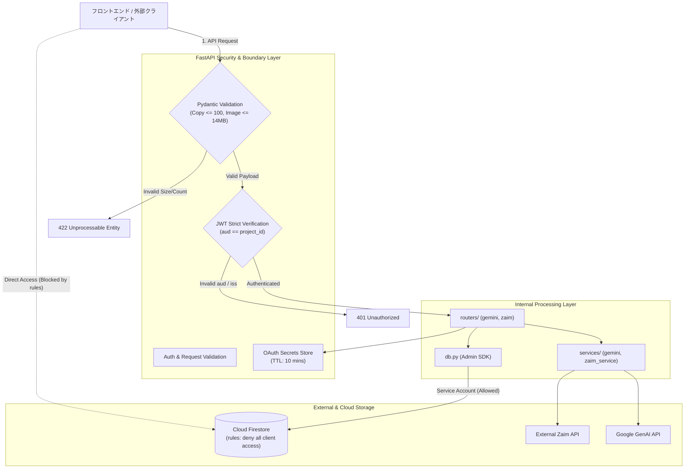
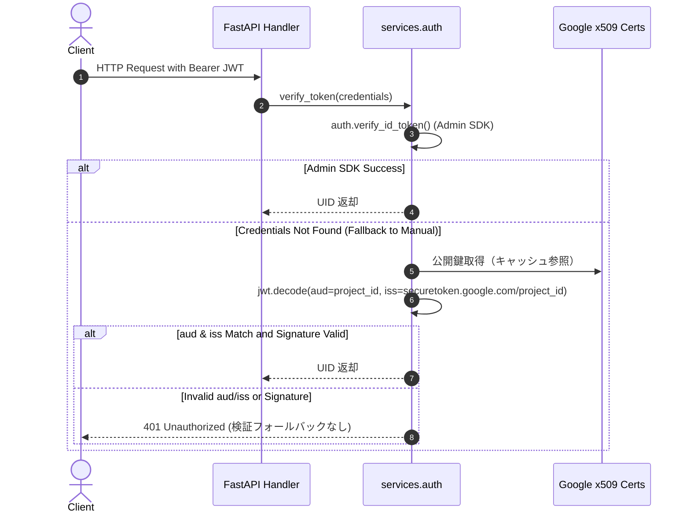
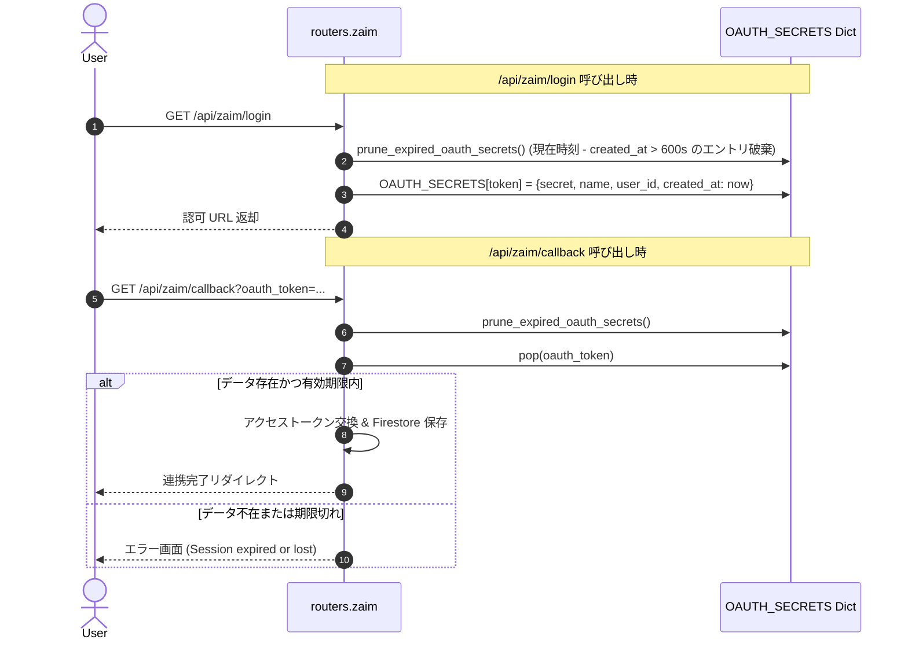

# Design Document: security-hardening

## Overview
**Purpose**: 本機能は、Zaim Lens における重大な認証バイパス脆弱性の解消、過大ペイロード（画像およびコピー明細リスト）に対する DoS 防御、OAuth 連携用インメモリセッションのメモリリーク解消、および Firestore セキュリティルールの自動デプロイ（IaC 化）を実現します。
**Users**: すべての正規ユーザーのデータ分離と保護を保証し、システム運用者のインフラ安定性とセキュリティ運用コストを大幅に改善します。
**Impact**: 不正な JWT トークンや規定サイズ・件数を超えるリクエストはフレームワーク境界で即座に遮断され、データベースは外部直アクセスから完全に保護されます。

### Goals
- Firebase JWT トークンのプロジェクトID（Audience / Issuer）厳格検証を徹底し、なりすまし脆弱性を排除する。
- リクエストスキーマで上限値を設定し、100 件超の履歴コピーや 10MB 相当を超える画像解析リクエストを 422 で即座に弾く。
- OAuth 一時シークレット辞書に 10 分間の TTL 機構を導入し、プロセス内メモリの肥大化を防止する。
- `firestore.rules` をコードベースで管理し、GitHub Actions から自動デプロイしてクライアント直接アクセスを恒常遮断する。

### Non-Goals
- Gemini API や Zaim API のレートリミット制御（BYOK 思想に基づきユーザー自己責任とする）。
- Redis 等の外部キャッシュサービスの導入（現行規模と構成のシンプルさを維持）。
- フロントエンド UI のデザイン変更。

---

## Boundary Commitments

### This Spec Owns
- `services/auth.py` における JWT 手動検証アルゴリズムおよび例外送出ポリシー。
- `schemas.py` における `ParseRequest` および `CopyRequest` のフィールド制約（`max_length`）。
- `routers/zaim.py` における `OAUTH_SECRETS` の有効期限管理（オンデマンド掃除ロジック）。
- `firestore.rules` のセキュリティルール定義および `.github/workflows/deploy.yml` のルールデプロイ設定。
- セキュリティ・バリデーション制約に関する単体・結合テストスイート。

### Out of Boundary
- 既存の Zaim API 通信ロジック（`services/zaim_client.py`, `services/zaim_service.py`）の業務フロー。
- Gemini AI によるレシート解析プロンプトおよび解析アルゴリズム。
- フロントエンドの認証フロー（Firebase Auth SDK 側）。

### Allowed Dependencies
- `firebase-admin` / `PyJWT`: JWT デコードおよび署名検証。
- `pydantic`: リクエストデータの境界値検証。
- `firebase-tools`: GitHub Actions 上での Firestore ルールデプロイ。

### Revalidation Triggers
- `FIREBASE_PROJECT_ID` または `GOOGLE_CLOUD_PROJECT` 環境変数の命名規則変更。
- `CopyRequest` または `ParseRequest` のスキーマフィールド定義の変更。
- デプロイワークフロー（`deploy.yml`）の認証プロバイダ（WIF）構成の変更。

---

## Architecture

### Existing Architecture Analysis
現行の FastAPI 3層アーキテクチャ（Handler / Service / Data Access）に則り、以下のレイヤで各保護機構を配置します：
1. **Handler / Schema Layer**: 入力検証（Pydantic v2 `Field` 制約）により、不正・過大データをサービス層に到達させず 422 で拒否。
2. **Service Layer**: `services/auth.py` でトークンの Audience/Issuer を厳格検証し、不正トークンを 401 で拒絶。
3. **Session Cache**: `routers/zaim.py` のインメモリ辞書にタイムスタンプとオンデマンド掃除処理を付与。
4. **Infra Layer**: Cloud Firestore のセキュリティルールをデプロイ時に自動同期。

### Architecture Pattern & Boundary Map



### Technology Stack

| Layer | Choice / Version | Role in Feature | Notes |
|---|---|---|---|
| Validation | Pydantic v2 (`>= 2.13.4`) | ペイロード長・要素数の上限検証 | `Field(..., min_length=..., max_length=...)` |
| Authentication | PyJWT / Cryptography | JWT 署名およびクレーム（`aud`, `iss`）の厳格検証 | フォールバック完全排除 |
| In-Memory Cache | Python `dict` + `time.time()` | OAuth 一時シークレットの TTL 管理 | 10分（600秒）TTL |
| Infrastructure | Cloud Firestore Security Rules v2 | クライアント直アクセスの完全遮断 | `allow read, write: if false;` |
| CI/CD | GitHub Actions + `firebase-tools` | ルール自動デプロイ | WIF 認証の再利用 |

---

## File Structure Plan

### Directory Structure
```
zaim-lens/
├── firestore.rules               # [NEW] Firestore 全拒否セキュリティルール
├── firebase.json                 # [NEW] Firebase デプロイ定義（Firestore rules 連携）
├── .github/
│   └── workflows/
│       └── deploy.yml            # [MODIFY] rules デプロイステップの追加
├── schemas.py                    # [MODIFY] CopyRequest / ParseRequest のバリデーション制約追加
├── services/
│   └── auth.py                   # [MODIFY] ルーズ検証削除、厳格な aud/iss 検証の強制
├── routers/
│   └── zaim.py                   # [MODIFY] OAUTH_SECRETS への TTL タイムスタンプ & オンデマンド掃除追加
└── tests/
    └── test_security_hardening.py # [NEW] セキュリティ強化に関するテストスイート
```

### Modified Files
- `schemas.py`: `CopyRequest.items_to_copy` に `min_length=1, max_length=100`、`ParseRequest.image_base64` に `min_length=1, max_length=14_000_000` を追加。
- `services/auth.py`: `verify_token_manually` 内の `verify_aud=False, verify_iss=False` のフォールバック処理を完全削除。
- `routers/zaim.py`: `OAUTH_SECRETS` に `created_at` を記録し、`prune_expired_oauth_secrets()` を定期実行。
- `.github/workflows/deploy.yml`: Cloud Run デプロイ直前に `npx -y firebase-tools deploy --only firestore:rules --project $PROJECT_ID` を実行。

---

## System Flows

### 1. 厳格な JWT 認証フロー


### 2. OAuth 一時シークレットの TTL 管理フロー


---

## Requirements Traceability

| Requirement | Summary | Components | Interfaces | Flows |
|---|---|---|---|---|
| 1.1 | 有効な正規トークンの UID 解決 | `services/auth.py` | `verify_token` | JWT Flow (1-6) |
| 1.2 | プロジェクトID不一致トークンの 401 拒絶 | `services/auth.py` | `verify_token_manually` | JWT Flow (8) |
| 1.3 | 不正署名トークンの 401 拒絶 | `services/auth.py` | `verify_token_manually` | JWT Flow (8) |
| 1.4 | ルーズ検証フォールバックの完全撤廃 | `services/auth.py` | `verify_token_manually` | JWT Flow (8) |
| 2.1 | 1〜100件のコピーリクエスト受理 | `schemas.py` | `CopyRequest` | Schema Check |
| 2.2 | 100件超のコピーリクエスト 422 拒絶 | `schemas.py` | `CopyRequest` | Schema Check (422) |
| 2.3 | 0件のコピーリクエスト 422 拒絶 | `schemas.py` | `CopyRequest` | Schema Check (422) |
| 3.1 | 規定内画像 Base64 リクエスト受理 | `schemas.py` | `ParseRequest` | Schema Check |
| 3.2 | 14,000,000文字超の画像データ 422 拒絶 | `schemas.py` | `ParseRequest` | Schema Check (422) |
| 3.3 | 空画像データの拒絶 | `schemas.py` | `ParseRequest` | Schema Check (422) |
| 4.1 | OAuth 一時セッションの登録時刻保持 | `routers/zaim.py` | `zaim_login` | OAuth TTL (1-4) |
| 4.2 | 10分以内のコールバック処理と使用済み破棄 | `routers/zaim.py` | `zaim_callback` | OAuth TTL (5-8) |
| 4.3 | 10分超過エントリの自動破棄 | `routers/zaim.py` | `prune_expired_oauth_secrets` | OAuth TTL (2, 6) |
| 4.4 | 期限切れトークンによるコールバックの拒否 | `routers/zaim.py` | `zaim_callback` | OAuth TTL (9) |
| 5.1 | CI/CD における rules 自動デプロイ | `.github/workflows/deploy.yml` | GitHub Actions Step | Infra Sync |
| 5.2 | クライアント直アクセスの完全遮断 | `firestore.rules` | Security Rules v2 | Direct Deny |
| 5.3 | サーバーサイド Admin SDK によるアクセス継続 | `db.py` | Firestore Client | Admin Allowed |

---

## Components and Interfaces

### 1. Authentication Service (`services/auth.py`)
- **Intent**: Firebase ID トークンの検証および安全な UID 解決。
- **Requirements**: 1.1, 1.2, 1.3, 1.4
- **Interface Contract**:
  ```python
  def verify_token_manually(id_token: str) -> str:
      """
      Decodes and verifies Firebase JWT using Google public certificates.
      MUST strictly enforce audience == project_id and issuer == https://securetoken.google.com/{project_id}.
      No loose decoding or claim-ignoring fallback is permitted.
      Raises: Exception on any verification or claim mismatch.
      """
  ```

### 2. Request Schemas (`schemas.py`)
- **Intent**: リクエストボディのサイズ・件数境界値の宣言的バリデーション。
- **Requirements**: 2.1, 2.2, 2.3, 3.1, 3.2, 3.3
- **Schema Definitions**:
  ```python
  class CopyRequest(BaseModel):
      source_account_id: str
      destination_account_id: str
      from_account_id: Optional[int] = None
      items_to_copy: List[CopyItem] = Field(..., min_length=1, max_length=100)
      force: bool = False

  class ParseRequest(BaseModel):
      image_base64: str = Field(..., min_length=1, max_length=14_000_000)
      account_id: Optional[str] = None
  ```

### 3. OAuth Session Manager (`routers/zaim.py`)
- **Intent**: OAuth 1.0a 認証途中のリクエストトークンシークレットを TTL 付きで一時保持。
- **Requirements**: 4.1, 4.2, 4.3, 4.4
- **Interface & Data Structure**:
  ```python
  TTL_SECONDS = 600  # 10 minutes

  OAUTH_SECRETS: Dict[str, Dict[str, Any]] = {}
  # Value: {"secret": str, "name": str, "user_id": str, "created_at": float}

  def prune_expired_oauth_secrets() -> None:
      """Removes entries older than TTL_SECONDS from OAUTH_SECRETS."""
  ```

### 4. Firestore Security Rules & CI/CD (`firestore.rules`, `.github/workflows/deploy.yml`)
- **Intent**: クライアント直接アクセスの完全遮断ポリシーのコード化と自動反映。
- **Requirements**: 5.1, 5.2, 5.3
- **Rules Definition (`firestore.rules`)**:
  ```javascript
  rules_version = '2';
  service cloud.firestore {
    match /databases/{database}/documents {
      match /{document=**} {
        allow read, write: if false;
      }
    }
  }
  ```

---

## Data Models

### Physical Data Model
- 本仕様では Firestore ドキュメントスキーマの変更はありません。
- インメモリ `OAUTH_SECRETS` の構造：
  ```json
  {
    "<oauth_token>": {
      "secret": "string",
      "name": "string",
      "user_id": "string",
      "created_at": 1726200000.0
    }
  }
  ```

---

## Error Handling
- **401 Unauthorized**:
  - `aud` 不一致、署名不正確、トークン破損時。
  - レスポンス: `{"detail": "Authentication failed: ..."}`
- **422 Unprocessable Entity**:
  - `items_to_copy` が 0 件または 101 件以上の場合。
  - `image_base64` が空文字または 14,000,000 文字超の場合。
  - レスポンス: FastAPI 標準のフィールドバリデーションエラー形式。
- **OAuth タイムアウト / セッション切れ**:
  - 10 分経過により `OAUTH_SECRETS` から破棄されたトークンでコールバックを受信した場合。
  - レスポンス: `Session lost or expired. Please try again.` のアラートを伴うトップ画面リダイレクト。

---

## Testing Strategy

### Unit Tests (`tests/test_security_hardening.py`)
1. **JWT 厳格検証テスト**:
   - 正しい Audience / Issuer のトークンは正常に UID を返す。
   - 他プロジェクトの Audience / Issuer を持つトークンは例外を送出し、401 エラーとなる。
   - 署名が無効なトークンは 401 エラーとなる。
2. **CopyRequest バリデーションテスト**:
   - `items_to_copy` が 100 件のリクエストはパース成功。
   - `items_to_copy` が 101 件のリクエストは `ValidationError`（422）。
   - `items_to_copy` が 0 件のリクエストは `ValidationError`（422）。
3. **ParseRequest バリデーションテスト**:
   - `image_base64` が 14,000,000 文字以下のリクエストはパース成功。
   - `image_base64` が 14,000,001 文字以上のリクエストは `ValidationError`（422）。
   - `image_base64` が空文字のリクエストは `ValidationError`（422）。
4. **OAuth TTL キャッシュテスト**:
   - 登録直後のエントリは `prune_expired_oauth_secrets()` 後も残存する。
   - 作成から 601 秒経過したエントリは `prune_expired_oauth_secrets()` で削除される。

### Regression Tests
- 既存テストスイートの実行: `uv run pytest`
- フロントエンド型・単体テスト: `npm run check`
- すべて Green であることを確認。
