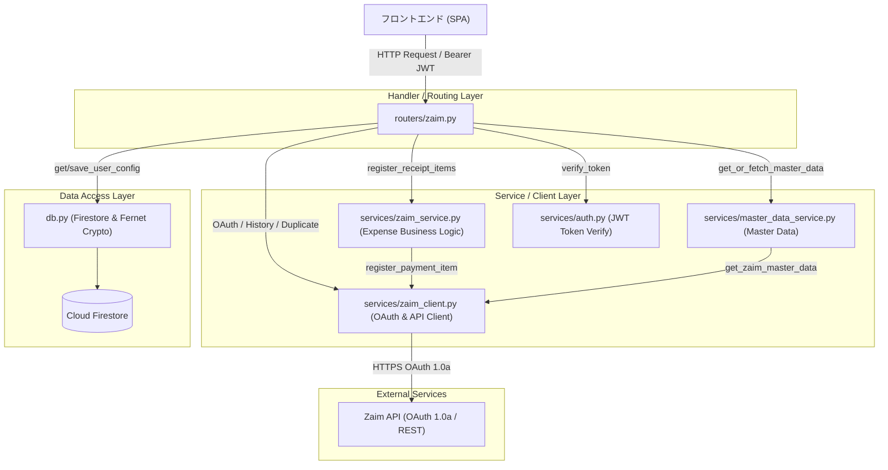
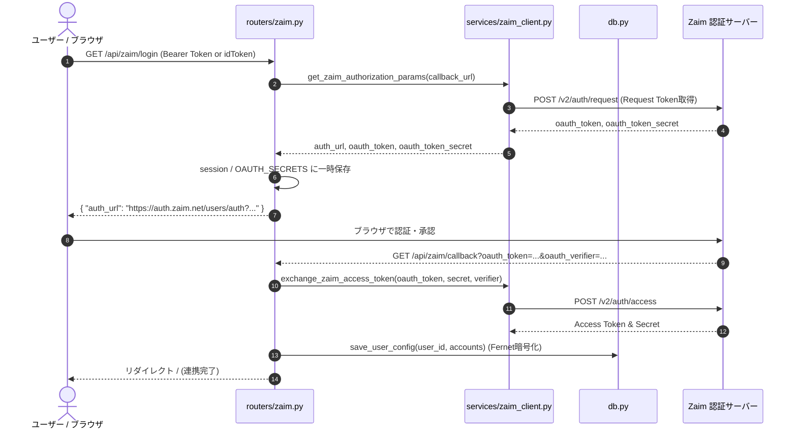
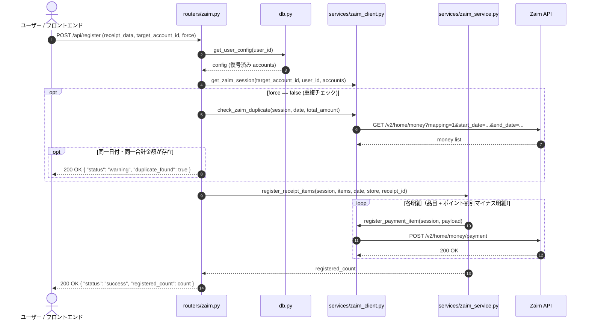
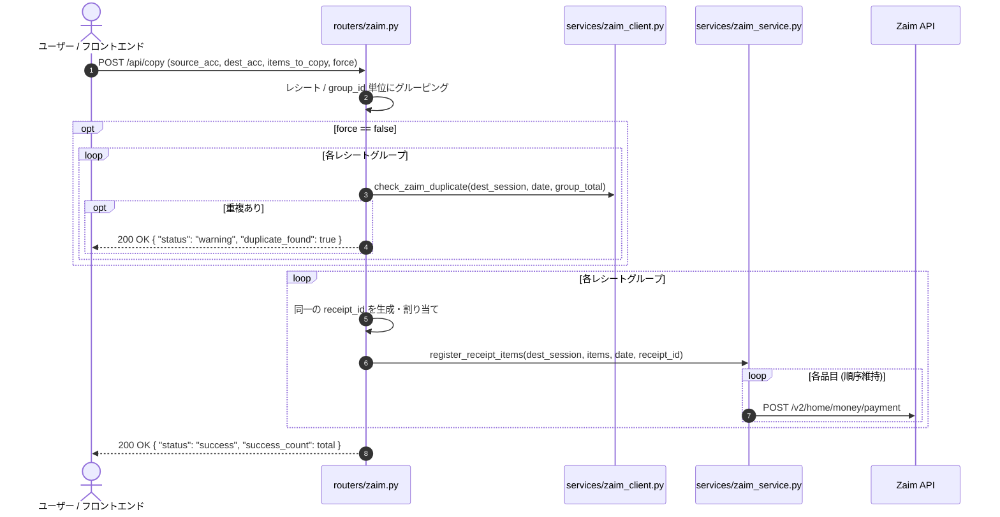

# Technical Design Document: Zaim Integration (`zaim-integration`)

## Overview

### Purpose
本仕様は、Zaim Lens における家計簿サービス「Zaim」との OAuth 1.0a 認証連携、マルチアカウント管理、マスタデータ（カテゴリ・ジャンル・口座）取得、レシート明細の支出一括登録（重複検知・ポイント値引き対応）、およびアカウント間での支出履歴コピー機能を実現するためのバックエンド技術設計書です。

### Users
- レシート画像や購入履歴から抽出した支出データを Zaim へ安全かつワンクリックで登録したい一般ユーザー。
- 個人用・家庭用・事業用など、複数の Zaim 家計簿アカウントを切り替えて運用したいマルチアカウントユーザー。

### Impact
既存の `routers/zaim.py`、`services/zaim_client.py`、`services/zaim_service.py`、`schemas.py` をアーキテクチャ規約に厳格に従ってリファクタリング・堅牢化し、クレデンシャル情報のマスキング対応、個別 Consumer Key の優先利用、および包括的な pytest モックテストスイートを導入します。

### Goals
- OAuth 1.0a 3-legged 認証フローの安全なハンドリングと Fernet 暗号化によるトークン永続化。
- 複数アカウントの登録・切替・名称変更・削除および手動クレデンシャル登録の提供。
- クレデンシャル返却 API における生シークレット非返却（マスキングおよび設定状態フラグ返却）の徹底。
- 同一レシートに属する複数明細・ポイント割引明細の確実な登録と同一日付・金額による重複登録防止。
- レシートのグループ単位・表示順序を維持したアカウント間履歴コピー機能の提供。
- 外部 Zaim API との通信を完全にモック化したユニットテストおよび結合テストの構築。

### Non-Goals
- レシート画像の OCR 解析および品目・カテゴリの推論（`gemini-api-backend` 仕様の所掌）。
- フロントエンド UI コンポーネントおよびスタイリングの実装。
- Zaim 以外の家計簿サービス（マネーフォワード等）との連携。

---

## Boundary Commitments

### This Spec Owns
- Zaim OAuth 1.0a 認証開始・コールバック・トークン交換・セッション管理。
- ユーザーごとの Zaim アカウント辞書（`accounts`）の CRUD および暗号化永続化。
- Zaim マスタデータ（カテゴリ・ジャンル・有効口座）の取得インターフェース。
- Zaim 支出登録ロジック（単一・複数品目、ポイント利用、同一レシートID紐付け）。
- Zaim 支出重複検知ロジック（同一日付・同一合計金額の判定）。
- Zaim 支出履歴取得およびアカウント間コピー（グループ化・順序保持）。
- クレデンシャル取得 API におけるマスキング仕様の定義と実装。

### Out of Boundary
- Gemini API を用いたレシート画像 OCR・品目抽出（`gemini-api-backend` が担当）。
- フロントエンド画面遷移・モーダル表示・トースト通知等のクライアント側 UI 実装。
- Firebase ID トークンの発行（Firebase Authentication が担当）。

### Allowed Dependencies
- `db.py`: Firestore へのユーザー設定永続化および Fernet 暗号化・復号。
- `services/auth.py`: `verify_token` によるユーザー認証および `user_id` (UID) の解決。
- `requests-oauthlib`: Zaim OAuth 1.0a 通信および署名生成。

### Revalidation Triggers
- Zaim API のエンドポイント仕様変更や認証プロトコルの変更（OAuth 2.0 移行等）。
- `schemas.py` における `RegisterRequest` や `CopyRequest` のフィールド構造変更。
- Firestore の `users` コレクションにおける `accounts` スキーマの破壊的変更。

---

## Architecture

### Existing Architecture Analysis
- 既存実装では `routers/zaim.py` にエンドポイントが集約され、`services/zaim_client.py` と `services/zaim_service.py` が外部通信とビジネスロジックを担当。
- 現状の課題として、`GET /api/zaim/credentials/{account_id}` で平文トークンが返却されており、アーキテクチャ規約 4.4（マスキング必須）に違反している点、および Zaim 連携に関する pytest 自動テストが存在しない点がある。

### Architecture Pattern & Boundary Map



### Technology Stack

| Layer | Choice / Version | Role in Feature | Notes |
| :--- | :--- | :--- | :--- |
| **Framework** | FastAPI (`>= 0.141.1`) | ルーティング、DI、バリデーション、OpenAPI 生成 | 非同期エンドポイント定義 |
| **Validation** | Pydantic v2 (`>= 2.13.4`) | リクエスト/レスポンスモデル定義 | `BaseModel`, 型検証 |
| **OAuth / Client** | `requests-oauthlib` (`>= 2.0.0`) | Zaim API OAuth 1.0a 認証・署名・通信 | `OAuth1Session` |
| **Encryption** | `cryptography` (Fernet) | トークンおよびシークレットの暗号化/復号 | AES-128-CBC + HMAC |
| **Persistence** | Google Cloud Firestore | ユーザー設定（`accounts`）の永続化 | Firebase Admin SDK |
| **Testing** | pytest, pytest-asyncio, httpx, unittest.mock | ユニット/結合テスト、APIモック | 外部通信なしで全自動実行 |

---

## File Structure Plan

### Directory Structure & Responsibilities
```text
zaim-lens/
├── routers/
│   └── zaim.py                 # Zaim OAuth、アカウント管理、カテゴリ、履歴、支出登録、履歴コピー
├── services/
│   ├── zaim_client.py          # Zaim API (OAuth 1.0a) 通信、セッション生成、各エンドポイントラッパー
│   ├── zaim_service.py         # 支出データ整形、ポイント値引き、一括登録ビジネスロジック
│   └── master_data_service.py  # マスタデータ（カテゴリ・ジャンル）取得サービス
├── db.py                       # Firestore CRUD、Fernet 暗号化/復号（accounts 辞書の暗号化）
├── schemas.py                  # Pydantic リクエスト/レスポンスモデル（マスキング対応モデル含む）
└── tests/
    ├── test_zaim_oauth.py      # OAuth 認証フロー・コールバック・トークン交換のテスト
    ├── test_zaim_service.py    # 支出登録、重複チェック、ポイント割引、コピーロジックのテスト
    └── test_zaim_api.py        # /api/register, /api/copy, /api/zaim/* の統合テスト
```

### Modified / Created Files
- `routers/zaim.py`: `GET /api/zaim/credentials/{account_id}` のマスキング修正、エラーレスポンスの統一。
- `services/zaim_client.py`: アカウント個別 `consumer_key` / `consumer_secret` の優先利用、堅牢なセッション生成。
- `schemas.py`: マスク済みクレデンシャル返却用モデル `ZaimCredentialsResponse` の追加。
- `tests/test_zaim_oauth.py`: [新規] OAuth ログインURL生成、トークン交換、コールバック処理のモックテスト。
- `tests/test_zaim_service.py`: [新規] `register_receipt_items`、`check_zaim_duplicate`、マイナスポイント登録のテスト。
- `tests/test_zaim_api.py`: [新規] FastAPI TestClient を用いた全 Zaim 関連エンドポイントの結合テスト。

---

## System Flows

### 1. OAuth 1.0a 認証連携フロー



### 2. 支出登録 & 重複検知フロー (`POST /api/register`)



### 3. アカウント間履歴コピーフロー (`POST /api/copy`)



---

## Requirements Traceability

| Requirement | 要件概要 | 実現コンポーネント | インターフェース / エンドポイント | フロー |
| :--- | :--- | :--- | :--- | :--- |
| **1.1** | Zaim OAuth 認証 URL の生成・返却 | `routers/zaim.py`, `services/zaim_client.py` | `GET /api/zaim/login`, `get_zaim_authorization_params` | Flow 1 |
| **1.2** | コールバック処理とアクセストークン交換・暗号化保存 | `routers/zaim.py`, `services/zaim_client.py`, `db.py` | `GET /api/zaim/callback`, `exchange_zaim_access_token` | Flow 1 |
| **1.3** | OAuth セッション欠落・エラーハンドリング | `routers/zaim.py` | `GET /api/zaim/callback` | Flow 1 |
| **1.4** | Zaim 通信障害時のエラーハンドリング | `services/zaim_client.py`, `routers/zaim.py` | `HTTPException(500)` | Flow 1 |
| **2.1** | 連携アカウント一覧取得 | `routers/zaim.py` | `GET /api/zaim/status`, `GET /api/accounts` | - |
| **2.2** | アカウント名称更新 | `routers/zaim.py`, `db.py` | `PATCH /api/zaim/credentials/{account_id}/name` | - |
| **2.3** | アカウント連携解除・削除 | `routers/zaim.py`, `db.py` | `DELETE /api/zaim/disconnect/{account_id}`, `DELETE /api/zaim/credentials/{account_id}` | - |
| **2.4** | 手動 API クレデンシャルの暗号化保存・更新 | `routers/zaim.py`, `db.py` | `POST /api/zaim/credentials` | - |
| **2.5** | 不正なアカウント ID 指定時の 404 エラー | `routers/zaim.py` | `HTTPException(404)` | - |
| **3.1** | カテゴリ・ジャンル一覧の取得 | `routers/zaim.py`, `services/master_data_service.py` | `GET /api/zaim/categories` | - |
| **3.2** | 有効な口座一覧（`active != -1`）の取得 | `routers/zaim.py`, `services/zaim_client.py` | `GET /api/zaim/accounts`, `fetch_zaim_accounts_raw` | - |
| **3.3** | アカウント未連携時の 400/401 エラー | `services/zaim_client.py` | `HTTPException(400)` | - |
| **4.1** | レシート明細の一括支出登録（レシートID紐付け） | `routers/zaim.py`, `services/zaim_service.py` | `POST /api/register`, `register_receipt_items` | Flow 2 |
| **4.2** | ポイント利用額のマイナス明細登録 | `routers/zaim.py`, `services/zaim_service.py` | `POST /api/register` | Flow 2 |
| **4.3** | 同一日付・金額の重複検知と警告返却 | `routers/zaim.py`, `services/zaim_client.py` | `POST /api/register`, `check_zaim_duplicate` | Flow 2 |
| **4.4** | 強制登録フラグ（`force=true`）による登録実行 | `routers/zaim.py` | `POST /api/register` | Flow 2 |
| **4.5** | 支出登録成功時の件数とステータス返却 | `routers/zaim.py` | `POST /api/register` | Flow 2 |
| **5.1** | 期間・日付指定による支出履歴取得（カテゴリ名付与） | `routers/zaim.py`, `services/zaim_client.py` | `GET /api/history`, `fetch_history_with_categories` | - |
| **5.2** | レシートグループ単位・順序保持でのアカウント間コピー | `routers/zaim.py`, `services/zaim_service.py` | `POST /api/copy` | Flow 3 |
| **5.3** | コピー先での重複検知と中断警告 | `routers/zaim.py`, `services/zaim_client.py` | `POST /api/copy` | Flow 3 |
| **5.4** | コピー成功件数の返却 | `routers/zaim.py` | `POST /api/copy` | Flow 3 |

---

## Components and Interfaces

### Component Summary

| Component | Layer | Intent | Req Coverage | Key Dependencies | Contracts |
| :--- | :--- | :--- | :--- | :--- | :--- |
| `routers/zaim.py` | Handler | Zaim 関連 API エンドポイントの定義と入出力制御 | 1.1–5.4 | `zaim_client`, `zaim_service`, `db`, `auth` | API |
| `services/zaim_client.py` | Client | Zaim API との OAuth 1.0a 認証および HTTP リクエスト | 1.1, 1.2, 3.1–3.3, 4.3, 5.1 | `requests_oauthlib` | Service |
| `services/zaim_service.py` | Service | 支出明細の整形、ポイント値引き、レシート単位の一括登録 | 4.1, 4.2, 5.2 | `zaim_client` | Service |
| `services/master_data_service.py` | Service | Zaim マスタデータ（カテゴリ・ジャンル）取得 | 3.1 | `zaim_client` | Service |
| `db.py` | Data Access | Firestore 永続化および Fernet 暗号化・復号 | 1.2, 2.2–2.4 | `cryptography.fernet`, `firestore` | State |
| `schemas.py` | Schema | Pydantic v2 リクエスト/レスポンスモデル定義 | 1.1–5.4 | `pydantic` | Domain Model |

### Detailed Component Specifications

#### 1. Router Layer (`routers/zaim.py`)

| Field | Detail |
| :--- | :--- |
| **Intent** | HTTP リクエストの受付、バリデーション、Service/DB 連携、レスポンス整形 |
| **Requirements** | 1.1, 1.2, 1.3, 1.4, 2.1, 2.2, 2.3, 2.4, 2.5, 3.1, 3.2, 4.1, 4.2, 4.3, 4.4, 4.5, 5.1, 5.2, 5.3, 5.4 |

##### API Contract
| Method | Endpoint | Request Model | Response / Status | Error Codes |
| :--- | :--- | :--- | :--- | :--- |
| `GET` | `/api/zaim/login` | Query: `name`, `idToken` | `{"auth_url": str}` | 401, 500 |
| `GET` | `/api/zaim/callback` | Query: `oauth_token`, `oauth_verifier` | HTML (Redirect to `/`) | 400, 500 |
| `GET` | `/api/zaim/status` | Header: `Bearer <JWT>` | `{"accounts": List[AccountStatus]}` | 401 |
| `DELETE` | `/api/zaim/disconnect/{account_id}` | Header: `Bearer <JWT>` | `{"status": "success"}` | 401, 404 |
| `GET` | `/api/zaim/accounts` | Query: `account_id`, Header: `Bearer <JWT>` | `List[ZaimAccount]` | 400, 401 |
| `GET` | `/api/zaim/categories` | Query: `account_id`, Header: `Bearer <JWT>` | `{"master_categories": list, "master_genres": list}` | 400, 401, 500 |
| `POST` | `/api/register` | Body: `RegisterRequest`, Header: `Bearer <JWT>` | `{"status": str, "registered_count": int, ...}` | 400, 401, 500 |
| `GET` | `/api/history` | Query: `account_id`, `period`, `start_date`, `end_date` | `{"history": list}` | 400, 401, 500 |
| `POST` | `/api/copy` | Body: `CopyRequest`, Header: `Bearer <JWT>` | `{"status": str, "success_count": int, ...}` | 400, 401, 500 |
| `GET` | `/api/zaim/credentials/{account_id}` | Header: `Bearer <JWT>` | `ZaimCredentialsResponse` (Masked) | 401, 404 |
| `POST` | `/api/zaim/credentials` | Body: `ZaimCredentialsRequest`, Header: `Bearer <JWT>` | `{"status": "success", "accounts": list}` | 400, 401 |
| `PATCH` | `/api/zaim/credentials/{account_id}/name` | Body: `ZaimAccountUpdateRequest`, Header: `Bearer <JWT>` | `{"status": "success"}` | 401, 404 |
| `DELETE` | `/api/zaim/credentials/{account_id}` | Header: `Bearer <JWT>` | `{"status": "success"}` | 401, 404 |

#### 2. Client Service (`services/zaim_client.py`)

##### Service Interface
```python
def get_zaim_session(account_id: str, user_id: str, accounts_config: Dict[str, Any]) -> OAuth1Session:
    """アカウント個別Consumer Keyを優先し、なければシステム環境変数を用いてOAuth1Sessionを生成"""
    ...

def get_zaim_authorization_params(callback_url: str) -> Dict[str, str]:
    """Request Token を取得し、認証 URL と Token Secret を返却"""
    ...

def exchange_zaim_access_token(oauth_token: str, request_token_secret: str, oauth_verifier: str) -> Dict[str, str]:
    """Verifier を用いて Access Token と Token Secret に交換"""
    ...

def check_zaim_duplicate(session: OAuth1Session, date: str, total_amount: int) -> bool:
    """指定日付・同一金額の支出が存在するか判定"""
    ...

def register_payment_item(session: OAuth1Session, payload: Dict[str, Any]) -> bool:
    """Zaim /v2/home/money/payment に単一明細を登録"""
    ...

def fetch_history_with_categories(session: OAuth1Session, master_data: Dict[str, Any], params: Dict[str, Any]) -> List[Dict[str, Any]]:
    """支出履歴を取得し、カテゴリ名・ジャンル名をマッピングして返却"""
    ...
```

#### 3. Business Service (`services/zaim_service.py`)

##### Service Interface
```python
def register_receipt_items(
    session: OAuth1Session,
    items: List[Dict[str, Any]],
    date: str,
    store_name: Optional[str] = None,
    from_account_id: Optional[int] = None,
    receipt_id: Optional[int] = None
) -> int:
    """
    同一レシートIDを付与して複数品目を順序通りにZaimへ登録。
    ポイント利用などのマイナス明細もそのまま処理する。
    """
    ...
```

---

## Data Models

### Pydantic Models (`schemas.py`)

```python
from typing import List, Optional
from pydantic import BaseModel

class ZaimAccount(BaseModel):
    id: int
    name: str

class ZaimAccountUpdateRequest(BaseModel):
    name: str

class ZaimCredentialsRequest(BaseModel):
    account_id: Optional[str] = None
    name: str = "Default Account"
    consumer_key: str
    consumer_secret: str
    token: str
    token_secret: str

class ZaimCredentialsResponse(BaseModel):
    id: str
    name: str
    is_configured: bool
    consumer_key_last_4: Optional[str] = None
    token_last_4: Optional[str] = None

class RegisterRequest(BaseModel):
    receipt_data: ReceiptParserResult
    force: bool = False
    from_account_id: Optional[int] = None
    target_account_id: str = "1"
    receipt_id: Optional[int] = None

class CopyItem(BaseModel):
    mapping: int = 1
    category_id: int
    genre_id: int
    amount: int
    date: str
    name: str
    place: Optional[str] = None
    comment: Optional[str] = None
    group_id: Optional[int] = None
    from_account_id: Optional[int] = None

class CopyRequest(BaseModel):
    source_account_id: str
    destination_account_id: str
    from_account_id: Optional[int] = None
    items_to_copy: List[CopyItem]
    force: bool = False
```

### Firestore Document Structure (`users/{user_id}`)

```json
{
  "accounts": {
    "1": {
      "id": "1",
      "name": "個人用Zaim",
      "consumer_key": "<Fernet暗号化文字列または未設定>",
      "consumer_secret": "<Fernet暗号化文字列または未設定>",
      "token": "<Fernet暗号化文字列>",
      "token_secret": "<Fernet暗号化文字列>"
    }
  }
}
```

---

## Error Handling

### Error Strategy
- **400 Bad Request**: アカウント未登録、リクエストパラメータ不備、セッション欠落。
- **401 Unauthorized**: Firebase 認証トークン欠落・期限切れ。
- **404 Not Found**: 指定された `account_id` のアカウントが存在しない。
- **500 Internal Server Error**: Zaim API との通信失敗、暗号化/復号の致命的障害。

### Duplicate Warning Response (200 OK with warning)
重複チェックで重複候補が検知された場合は、処理を中断して確認用ステータスを返却する。
```json
{
  "status": "warning",
  "message": "重複の可能性がある支出が見つかりました（同一日付・同一金額）。",
  "duplicate_found": true
}
```

---

## Testing Strategy

### 1. Unit Tests (`tests/test_zaim_service.py`)
- `register_receipt_items`: 品目リストが渡された際に、同一 `receipt_id` が付与され、指定された順序で `register_payment_item` が呼び出されること。
- ポイント利用額（マイナス明細）が正しくペイロードに変換されて登録されること。
- `check_zaim_duplicate`: 同一日付・同一金額の支出が存在する場合に `True`、存在しない場合に `False` を返すこと。

### 2. OAuth & Integration Tests (`tests/test_zaim_oauth.py`)
- `get_zaim_authorization_params`: OAuth 1.0a Request Token 取得と認証 URL 生成のモック検証。
- `exchange_zaim_access_token`: Verifier から Access Token への交換と戻り値の検証。
- `GET /api/zaim/callback`: 正常なトークン交換後に DB に暗号化保存され、Cookie/Session がクリーンアップされること。

### 3. API Integration Tests (`tests/test_zaim_api.py`)
- `POST /api/register`: `force=false` で重複時に warning 返却、`force=true` で強制登録されること。
- `POST /api/copy`: レシートグループごとの重複判定と一括登録が正しく実行されること。
- `GET /api/zaim/credentials/{account_id}`: マスキングされた情報（末尾4桁のみ）が返却され、生トークン・シークレットが露出しないこと。
- `PATCH /api/zaim/credentials/{account_id}/name` & `DELETE`: アカウント名称更新と削除が正しく DB に反映されること。

---

## Security Considerations

### 1. クレデンシャルの暗号化とマスキング
- Firestore に保存されるすべての OAuth トークン（`token`, `token_secret`）および個別 Consumer Key/Secret は `db.py` により Fernet で暗号化保存される。
- クライアントへの返却時は末尾4文字のみを返し、中間者やブラウザログへの平文露出を完全に防止する。

### 2. OAuth コールバックと CSRF 対策
- SPA 環境下における Strict Cookie ブロックを考慮し、`OAUTH_SECRETS` による一時的なトークン・セークレットのマッピング管理を実施。
- コールバック完了後は即座にメモリおよびセッションから一時データを破棄する。
