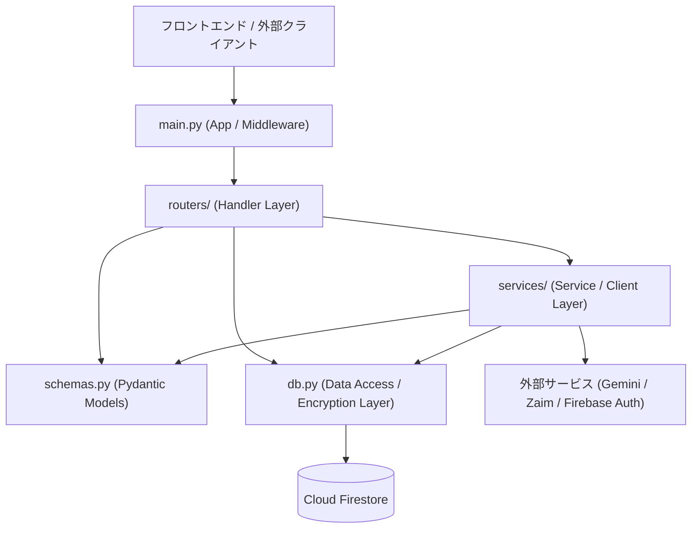
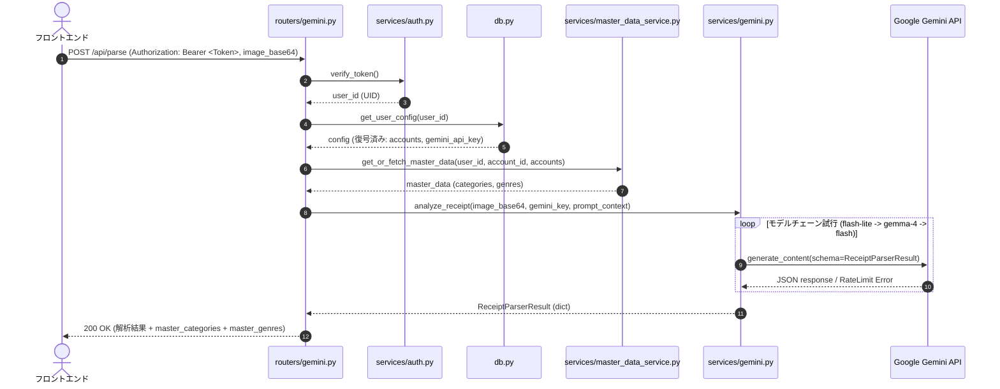
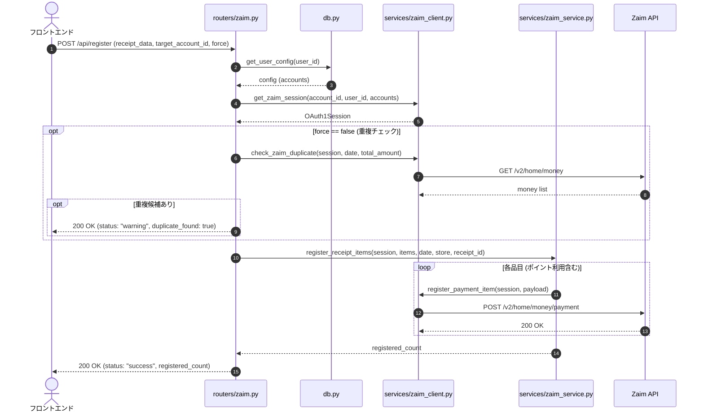

# Zaim Lens バックエンド アーキテクチャ定義書 (Architecture Specification)

本ドキュメントは、**Zaim Lens** のバックエンドシステム全体のアーキテクチャ、レイヤ責務、データフロー、共通規約、およびコーディング制約を定義した仕様書です。  
今後の機能追加（Spec-Driven Development / Kiro ワークフロー）および保守において、AIおよび開発者は本規約に厳格に従う必要があります。

---

## 1. システム概要 & 技術スタック

### 1.1 システム概要
Zaim Lens は、レシート画像やオンライン注文履歴のスクリーンショットから Google Gemini API を利用して品目・金額・カテゴリ・ジャンルを自動抽出し、家計簿サービス「Zaim」へワンクリックで支出登録を行う家計簿連携Webアプリケーションです。マルチアカウント対応、履歴コピー機能、ユーザーごとのAPIキー・OAuthトークンの安全な暗号化保存を提供します。

### 1.2 技術スタック一覧
| カテゴリ | 技術 / ライブラリ | バージョン / 補足 | 用途・選定理由 |
| :--- | :--- | :--- | :--- |
| **ランタイム / 言語** | Python | `>= 3.11` | 非同期処理、型ヒントの標準活用 |
| **環境・パッケージ管理** | uv | 標準 | 高速な依存解決、`.venv` 管理の統一 |
| **Webフレームワーク** | FastAPI | `>= 0.141.1` | 高速なASGI Webフレームワーク、自動OpenAPI生成 |
| **ASGIサーバー** | Uvicorn | `>= 0.52.1` | 標準ASGIサーバー |
| **データバリデーション** | Pydantic v2 | `>= 2.13.4` | 型安全なスキーマ定義、シリアライズ/デシリアライズ |
| **データベース / BaaS** | Google Cloud Firestore / Firebase Admin SDK | `>= 7.5.0` | ユーザー設定・連携情報・キャッシュの永続化 |
| **認証 (Auth)** | Firebase Authentication (JWT / Bearer) | PyJWT / cryptography | ユーザー認証トークンの検証とユーザーID（UID）解決 |
| **生成AI SDK** | Google GenAI SDK (`google-genai`) | `>= 2.17.0` | レシート画像のOCR解析・カテゴリ推論（Gemini 2.5/Flash/Lite/Gemmaフォールバック） |
| **外部API連携 (OAuth)** | requests-oauthlib | `>= 2.0.0` | Zaim API (OAuth 1.0a 3-legged) 認証およびAPIコール |
| **暗号化 (Crypto)** | Cryptography (Fernet / AES-128-CBC) | `>= 50.0.0` | DB保存時のクレデンシャル暗号化 (Zaim Token / Gemini Key) |
| **セッション管理** | Starlette SessionMiddleware / itsdangerous | `>= 2.2.0` | OAuth認証中の一時トークン・シークレット保持 |
| **テンプレートエンジン** | Jinja2 | `>= 3.1.6` | サーバーサイドHTMLテンプレートレンダリング |
| **テストフレームワーク** | pytest, pytest-asyncio, httpx | dev | 非同期APIテストおよびユニットテスト |

---

## 2. ディレクトリ構成とレイヤ責務

### 2.1 ディレクトリ構成
```text
zaim-lens/
├── .kiro/                      # 仕様書・ステアリング・ルール
│   ├── rules/                  # 共通アーキテクチャ・コーディングルール
│   ├── steering/               # プロジェクトメモリ (Kiro Steering)
│   └── specs/                  # 機能単位の仕様書 (CC-SDD)
├── routers/                    # Handler / Routing レイヤ (エンドポイント定義)
│   ├── __init__.py
│   ├── system.py               # 静的ページ、ヘルスチェック、ユーザー削除、共通設定
│   ├── zaim.py                 # Zaim OAuth、アカウント管理、カテゴリ、履歴、支出登録、履歴コピー
│   └── gemini.py               # レシートOCR解析、Gemini APIキー管理
├── services/                   # Service / UseCase レイヤ (ビジネスロジック & 外部APIクライアント)
│   ├── __init__.py
│   ├── auth.py                 # Firebase JWT検証、UID解決、公開鍵キャッシュ
│   ├── gemini.py               # Gemini SDKクライアント、モデルチェーンフォールバック、プロンプト処理
│   ├── master_data_service.py  # Zaimマスタデータ（カテゴリ・ジャンル）取得ロジック
│   ├── zaim_client.py          # Zaim API (OAuth1.0a) 通信、エンドポイントラッパー
│   └── zaim_service.py         # Zaim支出データ構築・一括登録ロジック
├── static/                     # 静的アセット (CSS, JS, アイコン, robots.txt, sitemap.xml)
├── templates/                  # Jinja2 HTMLテンプレート (index.html, privacy.html, terms.html)
├── tests/                      # pytest テストスイート (API・暗号化・サービステスト)
├── db.py                       # Data Access レイヤ (Firestoreクライアント, Fernet暗号化・復号)
├── schemas.py                  # Schema / Domain Model レイヤ (Pydanticリクエスト/レスポンスモデル)
├── main.py                     # アプリケーション初期化、ミドルウェア設定、ルーティング統合
├── pyproject.toml              # プロジェクト定義・依存関係 (uv)
└── uv.lock                     # ロックファイル
```

### 2.2 レイヤ責務と依存ルール



#### 各層の役割
1. **Handler / Routing Layer (`routers/*.py`, `main.py`)**
   - HTTPリクエストの受け付け、パス/クエリパラメータおよびリクエストボディの検証。
   - `Depends(verify_token)` を用いたユーザー認証とUID注入。
   - Service層の呼び出しと、HTTPレスポンス（ステータスコード・JSON・HTML）への変換。
   - **制約**: 外部API通信（Gemini/Zaim）をルーター内で直接実行せず、必ず `services/` 配下の関数を呼ぶこと。

2. **Service / Client Layer (`services/*.py`)**
   - アプリケーションのビジネスロジック（レシート解析、Zaim支出構築、モデルフォールバック、重複チェック等）。
   - 外部APIとの通信ハンドリング（`google-genai`, `requests-oauthlib`）。
   - 外部API特有のエラー（レートリミット429、認証エラー等）を捕捉し、適切な `HTTPException` に変換。
   - **制約**: ルーターやリクエストオブジェクトに依存しない純粋な関数/クラスとして設計すること。

3. **Data Access / Persistence Layer (`db.py`)**
   - FirestoreへのCRUD操作（ユーザー設定、マスタデータキャッシュ）。
   - クレデンシャル（Gemini API Key、Zaim Consumer Secret、OAuth Token等）の暗号化（`encrypt_value`）および復号（`decrypt_value`）。
   - **制約**: クレデンシャルを平文のままFirestoreへ保存することは固く禁止。DB層からRouter/Service層へ返す辞書データは自動的に復号済みとする。

4. **Schema / Model Layer (`schemas.py`)**
   - Pydantic v2 `BaseModel` によるリクエスト/レスポンス/ドメインモデルの定義。
   - **制約**: 他の層に依存しない独立した定義とすること。

---

## 3. 標準データフロー

### 3.1 レシート解析フロー (`POST /api/parse`)


### 3.2 Zaim支出登録フロー (`POST /api/register`)


---

## 4. 共通規約・共通パターン

### 4.1 認証・認可規約
- **Bearer Token (Firebase ID Token)**:
  - 保護されたエンドポイントはすべて `user_id: str = Depends(verify_token)` を付与すること。
  - トークン検証は Firebase Admin SDK (`auth.verify_id_token`) を優先し、ローカル環境や認証情報不在時は公開鍵キャッシュによる手動署名検証 (`verify_token_manually`) へフォールバック。
  - 認証成功時、24時間に1回のスロットル付きで `last_login_at` を更新。
- **未認証アクセス**:
  - `verify_token_optional` はOAuthリダイレクト等の特殊な用途に限定。

### 4.2 レスポンス形式の標準規約
1. **成功時レスポンス (JSON)**
   - アクション系（作成・更新・削除）:
     ```json
     {
       "status": "success",
       "message": "処理完了メッセージ",
       "...": "必要に応じた追加データ"
     }
     ```
   - 警告 / 確認要求（重複検知など）:
     ```json
     {
       "status": "warning",
       "message": "ユーザーへの確認メッセージ",
       "duplicate_found": true
     }
     ```
   - 取得系（クエリ）:
     - 単一オブジェクト、配列、または Pydantic モデルをそのまま返却（FastAPIによるシリアライズ）。

2. **エラー時レスポンス (`HTTPException`)**
   - FastAPI標準の `HTTPException` を使用し、一貫したステータスコードを返却する。
     ```json
     {
       "detail": "エラー内容の説明（ユーザー向けまたはデバッグ用）"
     }
     ```

### 4.3 HTTPステータスコード割り当て方針
| コード | 用途 | 発生シナリオ例 |
| :--- | :--- | :--- |
| **200 OK** | 正常完了 | データの取得、更新、削除、解析成功 |
| **400 Bad Request** | リクエスト不正 / 前提条件未達 | 不正なBase64画像、Zaimアカウント未設定、APIキー未設定 |
| **401 Unauthorized** | 認証エラー | Firebase JWTトークン欠落・期限切れ・不正署名 |
| **404 Not Found** | リソース不在 | 指定IDのアカウントが存在しない、静的ファイル不在 |
| **429 Too Many Requests** | レートリミット到達 | Gemini API利用枠上限・クォータ制限 |
| **500 Internal Server Error** | サーバー内部エラー | 外部API予期せぬ通信障害、暗号化/復号致命的障害 |

### 4.4 暗号化とクレデンシャル管理規約
- **対象データ**:
  - `gemini_api_key`
  - Zaim OAuth `consumer_key`, `consumer_secret`, `token`, `token_secret`
- **暗号化方式**:
  - `ENCRYPTION_KEY` 環境変数を SHA-256 でハッシュ化し、32バイトのURLセーフBase64鍵を生成した Fernet (AES-128-CBC + HMAC) 暗号。
- **データ返却時のマスキング**:
  - クライアントへクレデンシャル情報を返すAPI（`/api/gemini/credentials`, `/api/zaim/credentials` 等）では、全文字を返却せず末尾4文字のみ（`api_key_last_4`）またはマスク表示を徹底すること。

### 4.5 マスタデータ管理
- **カテゴリ・ジャンルデータ**:
  - サーバー側のFirestoreキャッシュは廃止され、フロントエンドの `localStorage` キャッシュとZaim APIダイレクト取得 (`services/master_data_service.py`) で同期する方針。

---

## 5. コーディング規約・禁止事項（アンチパターン）

### 5.1 Python & 環境管理の必須ルール
- **uv の徹底**:
  - パッケージ追加は `uv add <package>`、開発パッケージは `uv add --dev <package>` を使用すること。
  - 直接 `pip install` や `python -m venv` を実行してはならない。
  - スクリプト実行やテスト実行は必ず `uv run pytest` や `uv run uvicorn ...` を使用すること。

### 5.2 コーディング規約
1. **型ヒント (Type Hints) の完全記述**:
   - 引数・戻り値には `typing` および Python 3.11 標準の型ヒントを明示する。
2. **Pydantic v2 の使用**:
   - モデル変換には `.model_dump()`、JSONパースには `.model_validate_json()` を使用する（非推奨の `.dict()`, `.parse_raw()` は使用禁止）。
3. **非同期処理 (async/await)**:
   - FastAPIのエンドポイント定義、非同期I/O（Gemini API非同期呼び出し `client.aio.models.generate_content` 等）には `async/await` を適切に使用する。
4. **環境変数の参照**:
   - `os.environ.get("KEY_NAME")` を用い、必須項目が不足している場合は起動時または実行時にわかりやすい例外メッセージを発生させる。

### 5.3 禁止事項（アンチパターン）
- ❌ **クレデンシャルの平文ログ出力**:
  - トークン、APIキー、パスワードを生のログに出力してはならない（デバッグログ含む）。
- ❌ **Router内での直接的な外部API通信 / DB直接操作の乱立**:
  - ロジックは必ず `services/` または `db.py` にカプセル化すること。
- ❌ **例外の握りつぶし (Bare Except)**:
  - `except:` だけでエラーを無視せず、必ず型を指定するか `traceback.print_exc()` で追跡可能にすること。
- ❌ **テスト無しのコード改変**:
  - 機能追加・修正後は `uv run pytest` を実行し、既存テスト（認証、パース、暗号化）が通過することを確認すること。

---

## 6. テスト戦略
### 6.1 バックエンド テストスイート (`uv run pytest`)
- `tests/test_gemini_service.py`: Geminiモデルフォールバックチェーンおよびモック解析の検証。
- `tests/test_gemini_parsing.py`: Geminiレスポンスのパースおよびデータ抽出ロジックの検証。
- `tests/test_api_parse.py`: `/api/parse` エンドポイントの統合テスト。
- `tests/test_db_encryption.py`: Fernet暗号化・復号の完全性検証。
- `tests/test_gemini_credentials.py`: クレデンシャル保存・削除・マスキングの検証。
- `tests/test_zaim_api.py`: Zaim APIエンドポイント・カテゴリ・重複チェック連携のテスト。
- `tests/test_zaim_oauth.py`: Zaim OAuth 1.0aフローおよびセッション管理のテスト。
- `tests/test_zaim_service.py`: Zaim支出明細構築および登録処理のテスト。

### 6.2 フロントエンド テストスイート (`npm run test`)
- `tests/test_history_logic.js`: 履歴コピーの日付範囲計算、レシート別グルーピング、選択件数集計の単体テスト。
- `tests/test_receipt_queue_logic.js`: レシートキューの選択・スキップ・削除・状態遷移ロジックの単体テスト。
- `tests/test_receipt_validation.js`: レシート入力値（日付・品目・金額・ステータス）のリアルタイムバリデーション単体テスト。
