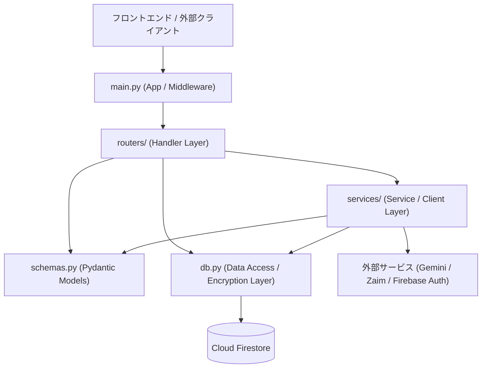

# Backend Architecture & API Standards

**Zaim Lens** のバックエンドシステムにおけるアーキテクチャ設計、レイヤ責務、API通信規約、セキュリティ、およびコーディング制約を定義したプロジェクトメモリです。

---

## 1. レイヤアーキテクチャ & 依存ルール

FastAPI による 3 層アーキテクチャ（Handler / Service / Data Access）を採用し、レイヤ間の依存関係を一方向に維持します。



### レイヤ責務と依存制約
1. **Handler / Routing Layer (`routers/`)**:
   - HTTP リクエストの受付、パラメータ検証、レスポンス（JSON/HTML）の返却。
   - `Depends(verify_token)` による認証と UID 解決。
   - **制約**: 外部 API 通信（Gemini / Zaim 等）や複雑な業務ロジックを直接記述せず、必ず `services/` を呼び出す。
2. **Service / Client Layer (`services/`)**:
   - ビジネスロジック、外部 API 通信（`google-genai`, `requests-oauthlib`）、データ集計・突合。
   - 外部エラー（レート制限 429、認証エラー等）を適切な `HTTPException` に変換。
   - **制約**: リクエストオブジェクトや Web フレームワークのコンテキストに依存しない純粋な関数・クラスとして設計する。
3. **Data Access Layer (`db.py`)**:
   - Firestore への CRUD 操作およびクレデンシャルの透過的な暗号化/復号。
   - **制約**: クレデンシャルは必ず暗号化して永続化する（平文保存の禁止）。
4. **Schema Layer (`schemas.py`)**:
   - Pydantic v2 `BaseModel` によるリクエスト/レスポンス/ドメインモデルの定義。
   - **制約**: 他のレイヤに依存しない独立したスキーマ定義とする。

---

## 2. API 通信 & レスポンス規約

### 2.1 認証・認可規約
- **Firebase Bearer Token**: 保護された全エンドポイントは `user_id: str = Depends(verify_token)` で UID を注入。
- **フォールバック検証**: Firebase Admin SDK が利用できないローカル環境等では、公開鍵キャッシュによる手動署名検証へ自動フォールバック。

### 2.2 統一レスポンス形式
FastAPI 標準の Pydantic シリアライズおよび一貫した JSON 構造を返却します。

1. **アクション系（作成・更新・削除）**:
   ```json
   {
     "status": "success",
     "message": "処理完了メッセージ"
   }
   ```
2. **警告・確認要求（重複検知等）**:
   ```json
   {
     "status": "warning",
     "message": "ユーザーへの確認メッセージ",
     "duplicate_found": true
   }
   ```
3. **エラー時 (`HTTPException`)**:
   ```json
   {
     "detail": "エラー内容の説明（ユーザー向けまたはデバッグ用）"
   }
   ```

### 2.3 HTTP ステータスコード割り当て方針
| コード | 用途 | 発生シナリオ例 |
| :--- | :--- | :--- |
| **200 OK** | 正常完了 | データ取得、更新、削除、解析完了 |
| **400 Bad Request** | リクエスト不正 / 前提未達 | Base64 画像不正、アカウント未設定、必須項目欠落 |
| **401 Unauthorized** | 認証エラー | Firebase JWT トークン欠落・期限切れ・不正署名 |
| **404 Not Found** | リソース不在 | 指定アカウントが存在しない、パス不在 |
| **429 Too Many Requests** | レート制限 | Gemini API 利用枠上限・クォータ制限到達 |
| **500 Internal Server Error** | サーバー内部障害 | 外部通信障害、暗号化/復号の致命的例外 |

---

## 3. セキュリティ & クレデンシャル保護

- **暗号化対象**: Gemini API キー、Zaim OAuth トークンおよびシークレット。
- **暗号化方式**: `ENCRYPTION_KEY` を基底とした Fernet (AES-128-CBC + HMAC) 暗号。DB 格納時は暗号化を必須とし、取得時に復号。
- **データ返却時のマスキング**: API レスポンスでクレデンシャルを返却する際は、全文字を返却せず末尾 4 文字（`api_key_last_4`）等のマスク表示を徹底する。

---

## 4. バックエンド開発規約 & アンチパターン

### 4.1 開発規約
- **型ヒントの完全記述**: 引数・戻り値に Python 3.11 標準の型ヒントを明示。
- **Pydantic v2 準拠**: モデルシリアライズには `.model_dump()`、パースには `.model_validate_json()` を使用（`.dict()`, `.parse_raw()` は禁止）。
- **非同期 I/O の活用**: エンドポイントおよび非同期 API 通信（Gemini 等）は `async/await` を適切に使用。

### 4.2 禁止事項（アンチパターン）
- ❌ **クレデンシャルの平文ログ出力**: トークンや API キーを生のログ（デバッグログ含む）に出力してはならない。
- ❌ **Router 内での外部 API 通信 / DB 直接操作**: ビジネスロジックをルーターに散乱させず、必ず `services/` や `db.py` にカプセル化する。
- ❌ **例外の握りつぶし (Bare Except)**: `except:` だけでエラーを無視せず、型指定またはトレーサビリティを確保する。
- ❌ **直接 pip / venv の使用**: 環境管理・実行は必ず `uv`（`uv run`）を通すこと。

---
_Focus on architectural patterns and standards, not exhaustive file lists or endpoint implementations_
